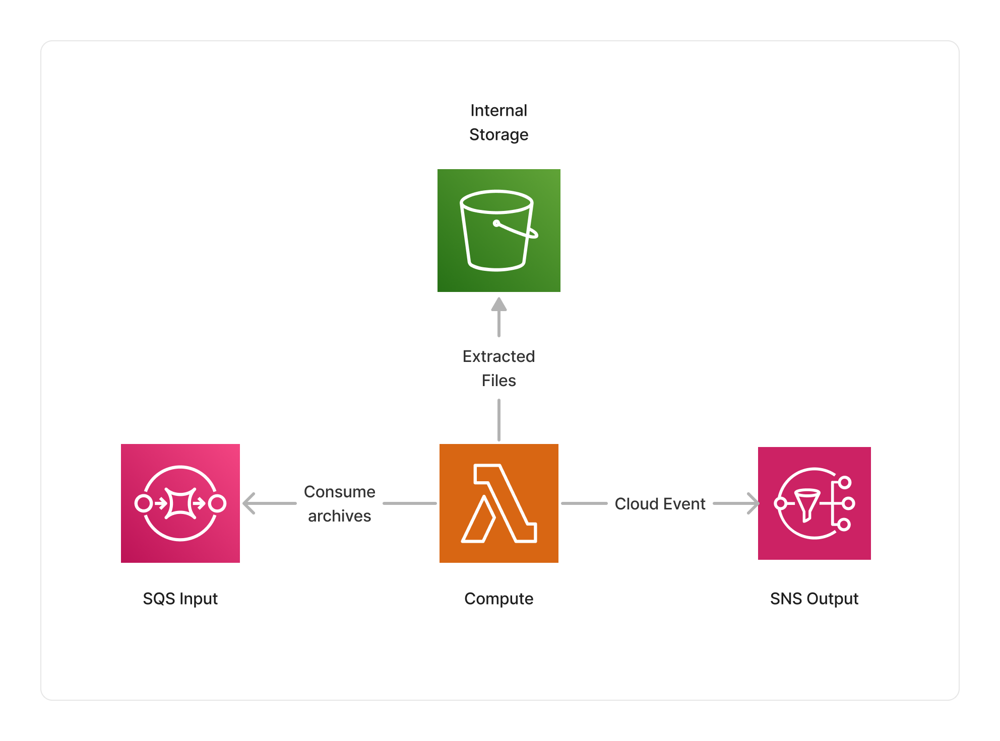

<span title="Label: Pro" data-view-component="true" class="Label Label--api text-uppercase">
  Unstable API
</span>
<span title="Label: Pro" data-view-component="true" class="Label Label--version text-uppercase">
  0.4.0
</span>
<span title="Label: Pro" data-view-component="true" class="Label Label--package">
  @project-lakechain/zip-inflate-processor
</span>
<br>

---

The Zip inflate processor makes it possible to extract the content of Zip archives and publish each file within them to other middlewares in a pipeline. This makes it possible for customers to process documents stored within Zip archives in a Lakechain pipeline.

---

### 🗄️ Inflating Archives

To use this middleware, you import it in your CDK stack and connect it to a data source that provides Zip archives, such as the [S3 Trigger](/project-lakechain/triggers/s3-event-trigger) if your Zip archives are stored in S3.

> ℹ️ The below example shows how to create a pipeline that inflates Zip archives uploaded to an S3 bucket.

```typescript
import { S3EventTrigger } from '@project-lakechain/s3-event-trigger';
import { ZipInflateProcessor } from '@project-lakechain/zip-inflate-processor';
import { CacheStorage } from '@project-lakechain/core';

class Stack extends cdk.Stack {
  constructor(scope: cdk.Construct, id: string) {
    // Sample bucket.
    const bucket = new s3.Bucket(this, 'Bucket', {});

    // The cache storage.
    const cache = new CacheStorage(this, 'Cache');

    // Create the S3 event trigger.
    const trigger = new S3EventTrigger.Builder()
      .withScope(this)
      .withIdentifier('Trigger')
      .withCacheStorage(cache)
      .withBucket(bucket)
      .build();

    // Create the Zip inflate processor.
    const zipProcessor = new ZipInflateProcessor.Builder()
      .withScope(this)
      .withIdentifier('ZipProcessor')
      .withCacheStorage(cache)
      .withSource(trigger)
      .build();
  }
}
```

#### Streaming Processing

> 💁 The Zip inflate processor processes Zip archives in streaming, meaning that the compute driving archive inflation do not need to hold the entire archive in memory. This makes it possible to process large archives without having to worry about memory constraints.

<br>

---

### 🏗️ Architecture

The Zip inflate processor uses AWS Lambda as a compute for inflating archives. The compute can run up to 15 minutes to extract the files part of a compressed archives, and provides the next middlewares in the pipeline with the extracted files.



<br>

---

### 🏷️ Properties

<br>

##### Supported Inputs

|  Mime Type  | Description |
| ----------- | ----------- |
| `application/zip` | Zip archives |

##### Supported Outputs

|  Mime Type  | Description |
| ----------- | ----------- |
| `*/*` | The Zip inflate processor will publish each file within archives to the next middlewares in the pipeline.

##### Supported Compute Types

| Type  | Description |
| ----- | ----------- |
| `CPU` | This middleware only supports CPU compute. |

<br>

---

### 📖 Examples

- [Inflate Pipeline](https://github.com/awslabs/project-lakechain/tree/main/examples/simple-pipelines/inflate-pipeline) - An example showcasing how to inflate archives.
