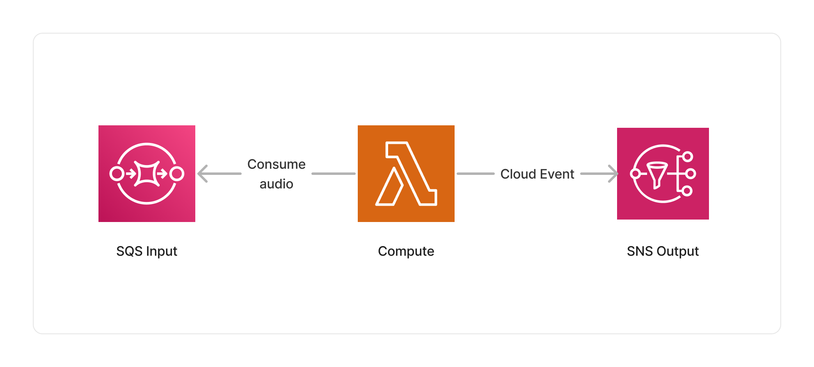

<span title="Label: Pro" data-view-component="true" class="Label Label--api text-uppercase">
  Unstable API
</span>
<span title="Label: Pro" data-view-component="true" class="Label Label--version text-uppercase">
  0.1.4
</span>
<span title="Label: Pro" data-view-component="true" class="Label Label--package">
  @project-lakechain/audio-metadata-extractor
</span>
<br>

---

The audio metadata extractor enriches document metadata with specific information about input audio documents, such as codec, bitrate, sample rate, duration, title, or album art information. Those metadata can then be later used by subsequent middlewares in the pipeline, or stored in a database.

---

### 🎧 Extracting Metadata

To use this middleware, you import it in your CDK stack and instantiate it as part of a pipeline.

```typescript
import { AudioMetadataExtractor } from '@project-lakechain/audio-metadata-extractor';
import { CacheStorage } from '@project-lakechain/core';

class Stack extends cdk.Stack {
  constructor(scope: cdk.Construct, id: string) {
    // The cache storage.
    const cache = new CacheStorage(this, 'Cache');
    
    // Extracts metadata from audio documents.
    const audioMetadata = new AudioMetadataExtractor.Builder()
      .withScope(this)
      .withIdentifier('AudioMetadata')
      .withCacheStorage(cache)
      .withSource(source) // 👈 Specify a data source
      .build();
  }
}
```

<br>

---

### 📄 Output

The audio metadata extraction middleware does not modify or alter source audio documents in any way. It instead enriches the metadata of the documents with captured information. Below is an example of metadata captured using this middleware.

<details>
  <summary>💁 Click to expand example</summary>

  ```json
  {
    "specversion": "1.0",
    "id": "1780d5de-fd6f-4530-98d7-82ebee85ea39",
    "type": "document-created",
    "time": "2023-10-22T13:19:10.657Z",
    "data": {
        "chainId": "6ebf76e4-f70c-440c-98f9-3e3e7eb34c79",
        "source": {
            "url": "s3://bucket/audio.mp3",
            "type": "audio/mpeg",
            "size": 245328,
            "etag": "1243cbd6cf145453c8b5519a2ada4779"
        },
        "document": {
            "url": "s3://bucket/audio.mp3",
            "type": "audio/mpeg",
            "size": 245328,
            "etag": "1243cbd6cf145453c8b5519a2ada4779"
        },
        "metadata": {
          "title": "Artist - Title",
          "properties": {
            "kind": "audio",
            "attrs": {
              "codec": "mp3",
              "bitrate": 320000,
              "sampleRate": 44100,
              "duration": 431.5
            }
          }
        },
        "callStack": []
    }
  }
  ```

</details>

<br>

---

### 🏗️ Architecture

This middleware runs within a Lambda compute based on the ARM64 architecture, and packages the [`music-metadata`](https://github.com/borewit/music-metadata) library to extract the metadata of audio documents.



<br>

---

### 🏷️ Properties

<br>

##### Supported Inputs

|  Mime Type  | Description |
| ----------- | ----------- |
| `audio/mpeg` | MPEG audio documents. |
| `audio/mp3` | MP3 audio documents. |
| `audio/mp4` | MP4 audio documents. |
| `audio/wav` | WAV audio documents. |
| `audio/x-wav` | WAV audio documents. |
| `audio/x-m4a` | M4A audio documents. |
| `audio/ogg` | OGG audio documents. |
| `audio/x-flac` | FLAC audio documents. |
| `audio/flac` | FLAC audio documents. |
| `audio/x-aiff` | AIFF audio documents. |
| `audio/aiff` | AIFF audio documents. |
| `audio/x-ms-wma` | WMA audio documents. |
| `audio/x-matroska` | MKV audio documents. |
| `audio/webm` | WebM audio documents. |
| `audio/aac` | AAC audio documents. |

##### Supported Outputs

*This middleware supports as outputs the same types as the supported inputs.*

##### Supported Compute Types

| Type  | Description |
| ----- | ----------- |
| `CPU` | This middleware only supports CPU compute. |

<br>

---

### 📖 Examples

- [Metadata Extraction Pipeline](https://github.com/awslabs/project-lakechain/tree/main/examples/simple-pipelines/metadata-extraction-pipeline) - Builds a simple metadata extraction pipeline.
