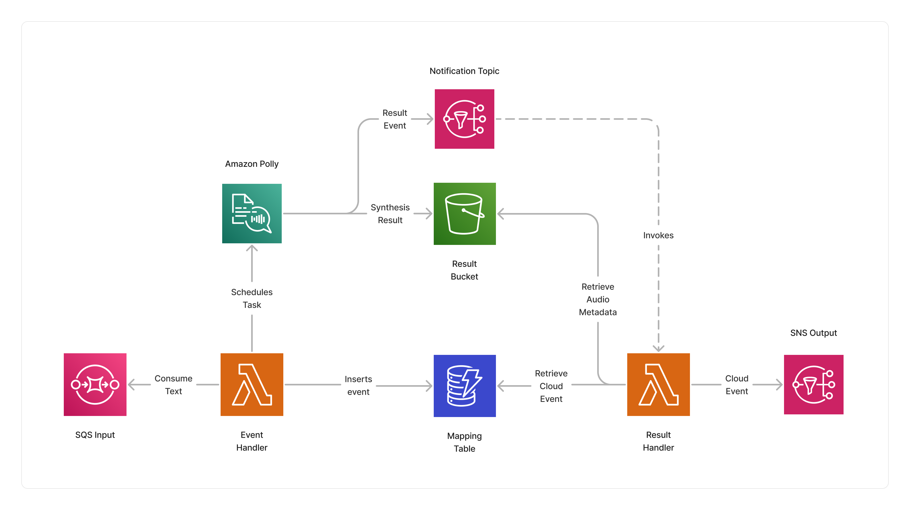

<span title="Label: Pro" data-view-component="true" class="Label Label--api text-uppercase">
  Unstable API
</span>
<span title="Label: Pro" data-view-component="true" class="Label Label--version text-uppercase">
  0.9.0
</span>
<span title="Label: Pro" data-view-component="true" class="Label Label--package">
  <a target="_blank" href="https://www.npmjs.com/package/@project-lakechain/polly-synthesizer">
    @project-lakechain/polly-synthesizer
  </a>
</span>
<span class="language-icon">
  <svg role="img" viewBox="0 0 24 24" width="30" xmlns="http://www.w3.org/2000/svg" style="fill: #3178C6;"><title>TypeScript</title><path d="M1.125 0C.502 0 0 .502 0 1.125v21.75C0 23.498.502 24 1.125 24h21.75c.623 0 1.125-.502 1.125-1.125V1.125C24 .502 23.498 0 22.875 0zm17.363 9.75c.612 0 1.154.037 1.627.111a6.38 6.38 0 0 1 1.306.34v2.458a3.95 3.95 0 0 0-.643-.361 5.093 5.093 0 0 0-.717-.26 5.453 5.453 0 0 0-1.426-.2c-.3 0-.573.028-.819.086a2.1 2.1 0 0 0-.623.242c-.17.104-.3.229-.393.374a.888.888 0 0 0-.14.49c0 .196.053.373.156.529.104.156.252.304.443.444s.423.276.696.41c.273.135.582.274.926.416.47.197.892.407 1.266.628.374.222.695.473.963.753.268.279.472.598.614.957.142.359.214.776.214 1.253 0 .657-.125 1.21-.373 1.656a3.033 3.033 0 0 1-1.012 1.085 4.38 4.38 0 0 1-1.487.596c-.566.12-1.163.18-1.79.18a9.916 9.916 0 0 1-1.84-.164 5.544 5.544 0 0 1-1.512-.493v-2.63a5.033 5.033 0 0 0 3.237 1.2c.333 0 .624-.03.872-.09.249-.06.456-.144.623-.25.166-.108.29-.234.373-.38a1.023 1.023 0 0 0-.074-1.089 2.12 2.12 0 0 0-.537-.5 5.597 5.597 0 0 0-.807-.444 27.72 27.72 0 0 0-1.007-.436c-.918-.383-1.602-.852-2.053-1.405-.45-.553-.676-1.222-.676-2.005 0-.614.123-1.141.369-1.582.246-.441.58-.804 1.004-1.089a4.494 4.494 0 0 1 1.47-.629 7.536 7.536 0 0 1 1.77-.201zm-15.113.188h9.563v2.166H9.506v9.646H6.789v-9.646H3.375z"/></svg>
</span>
<div style="margin-top: 26px"></div>

---

The Polly Synthesizer allows to synthesize speech from text using the [Amazon Polly](https://aws.amazon.com/polly/) service. Using this middleware, you can synthesize at scale speech from your plain text documents using a matrix of multiple languages and voices.

---

### 🗣️ Synthesizing Text

To use this middleware, you import it in your CDK stack and instantiate it as part of a pipeline.

> 💁 In the below example, we use the [NLP Processor](/project-lakechain/text-processing/nlp-text-processor) to detect the language of the text and then use the Polly synthesizer to convert the text to speech using the detected language.

```typescript
import { PollySynthesizer } from '@project-lakechain/polly-synthesizer';
import { NlpTextProcessor, dsl as l } from '@project-lakechain/nlp-text-processor';
import { CacheStorage } from '@project-lakechain/core';

class Stack extends cdk.Stack {
  constructor(scope: cdk.Construct, id: string) {
    // The cache storage.
    const cache = new CacheStorage(this, 'Cache');
    
    // Detect the language of the text using the NLP
    // processor.
    const nlpProcessor = new NlpTextProcessor.Builder()
      .withScope(this)
      .withIdentifier('Nlp')
      .withCacheStorage(cache)
      .withSource(source) // 👈 Specify a data source
      .withIntent(
        l.nlp().language()
      )
      .build();

    // Convert the text to speech using Amazon Polly.
    const synthesizer = new PollySynthesizer.Builder()
      .withScope(this)
      .withIdentifier('PollySynthesizer')
      .withCacheStorage(cache)
      .withSource(nlpProcessor)
      .build();
  }
}
```

<br />

---

#### Language Override

Amazon Polly needs to know the source language of the text to be able to associate with with a voice that is fit for synthesizing the text. In the previous example, we've used the [NLP Processor](/project-lakechain/text-processing/nlp-text-processor) to detect the language of the text and then use the Polly synthesizer to convert the text to speech using the detected language.

You can however manually override the source language of the text if your source documents share a common known language that is [supported by Amazon Polly](https://docs.aws.amazon.com/polly/latest/dg/SupportedLanguage.html).

```typescript
import { PollySynthesizer } from '@project-lakechain/polly-synthesizer';

const synthesizer = new PollySynthesizer.Builder()
  .withScope(this)
  .withIdentifier('PollySynthesizer')
  .withCacheStorage(cache)
  .withSource(source)
  .withLanguageOverride('en') // 👈 Override the language
  .build();
```

<br />

---

#### Voice Mapping

By default, the Polly synthesizer will randomly select a compatible voice associated with the input language of a document. You can however explicitly specify a list of voices that you would like to associate with each language to better control which voice gets used during the synthesis process.

In Amazon Polly, you can choose between [neural voices](https://docs.aws.amazon.com/polly/latest/dg/neural-voices.html) and standard voices. Neural voices can produce even higher quality voices than standard voices, and produce the most natural and human-like text-to-speech voices possible.

> 💁 Not all voices support the neural engine. You can find the list of supported voices for each language [here](https://docs.aws.amazon.com/polly/latest/dg/voicelist.html). The Polly synthesizer middleware validates the voice mappings you specify at deployment time to ensure they are correct.

```typescript
import { PollySynthesizer, dsl as v } from '@project-lakechain/polly-synthesizer';

const synthesizer = new PollySynthesizer.Builder()
  .withScope(this)
  .withIdentifier('PollySynthesizer')
  .withCacheStorage(cache)
  .withSource(source)
  // Specify specific voices for some languages.
  .withVoiceMapping('en', v.neural('Joanna'), v.neural('Matthew'))
  .withVoiceMapping('fr', v.standard('Celine'), v.neural('Lea'))
  .build();
```

<br />

---

### ℹ️ Limits

This middleware automatically applies a throttling mechanism when consuming messages from its input queue to stay within the minimal [Amazon Polly Throttling Rates](https://docs.aws.amazon.com/polly/latest/dg/limits.html) of 2 tps.

The applicable [limit](https://docs.aws.amazon.com/polly/latest/dg/limits.html) of 200,000 characters in Amazon Polly also applies to text documents processed by this middleware.

<br />

---

### 🏗️ Architecture

The Polly Synthesizer middleware builds on top of an event-driven architecture leveraging Amazon Polly [asynchronous jobs](https://docs.aws.amazon.com/polly/latest/dg/asynchronous.html) to synthesize long documents.

This architecture uses an *event handler* function which consumes input documents, schedules a synthesis task on Amazon Polly, and keeps track of input events in a DynamoDB table.

Once the synthesis task is completed, the *result handler* function is invoked when Amazon Polly publishes the results of the synthesis process on an SNS topic. It then retrieves the synthesized audio information, updates the CloudEvent with the new audio file, and publishes it to the next middlewares in the pipeline.



<br />

---

### 🏷️ Properties

<br />

##### Supported Inputs

|  Mime Type  | Description |
| ----------- | ----------- |
| `text/plain` | UTF-8 text documents. |

##### Supported Outputs

|  Mime Type  | Description |
| ----------- | ----------- |
| `audio/mpeg` | MP3 audio documents. |

##### Supported Compute Types

| Type  | Description |
| ----- | ----------- |
| `CPU` | This middleware only supports CPU compute. |

<br />

---

### 📖 Examples

- [Polly Synthesizer Pipeline](https://github.com/awslabs/project-lakechain/tree/main/examples/simple-pipelines/text-to-speech-pipelines/polly-synthesizer) - Builds a pipeline for synthesizing text to speech using Amazon Polly.
