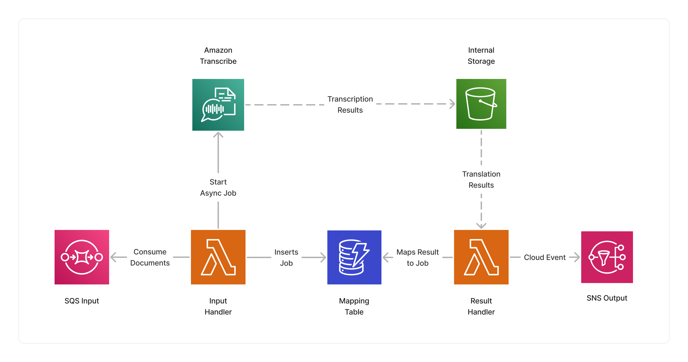

<span title="Label: Pro" data-view-component="true" class="Label Label--api text-uppercase">
  Unstable API
</span>
<span title="Label: Pro" data-view-component="true" class="Label Label--version text-uppercase">
  0.4.0
</span>
<span title="Label: Pro" data-view-component="true" class="Label Label--package">
  @project-lakechain/transcribe-audio-processor
</span>
<br>

---

The Transcribe audio processor is based on the [Amazon Transcribe](https://docs.aws.amazon.com/transcribe/latest/dg/what-is.html) and enables developers to create scalable transcription pipelines for audio documents.

---

### 📝 Transcribing Audio

To use this middleware, you import it in your CDK stack and instantiate it as part of a pipeline.

```typescript
import { TranscribeAudioProcessor } from '@project-lakechain/transcribe-audio-processor';
import { CacheStorage } from '@project-lakechain/core';

class Stack extends cdk.Stack {
  constructor(scope: cdk.Construct, id: string) {
    // The cache storage.
    const cache = new CacheStorage(this, 'Cache');
    
    // Transcribe audio documents to text.
    const transcribe = new TranscribeAudioProcessor.Builder()
      .withScope(this)
      .withIdentifier('TranscribeAudioProcessor')
      .withCacheStorage(cache)
      .withSource(source) // 👈 Specify a data source
      .build();
  }
}
```

<br>

---

#### Output Formats

This middleware supports transcribing audio documents into different output formats. By default, the `vtt` subtitle format is used. You can however specify one or multiple output formats by passing them to the `withOutputFormats` method.

> 💁 When specifying multiple output formats, this middleware will output multiple output documents, one for each format, to the next middlewares in the pipeline.

```typescript
import { TranscribeAudioProcessor, OutputFormat } from '@project-lakechain/transcribe-audio-processor';

const transcribe = new TranscribeAudioProcessor.Builder()
  .withScope(this)
  .withIdentifier('TranscribeAudioProcessor')
  .withCacheStorage(cache)
  .withSource(source)
  .withOutputFormats('vtt', 'srt') // 👈 Output formats
  .build();
```

You can choose between the following output formats : `srt`, `vtt`, and `json`.

<br>

---

### 🏗️ Architecture

This middleware implements an event-driven architecture leveraging Amazon Transcribe batch jobs in order to support bigger documents, and runs several Lambda functions to orchestrate the transcription jobs.

This design makes it possible to not spend time waiting for the transcriptions to be completed, but instead asynchronously keeps tracks of each transcription jobs and forwards them to the next middlewares in the pipeline once they are completed.



<br>

---

### 🏷️ Properties

<br>

##### Supported Inputs

|  Mime Type  | Description |
| ----------- | ----------- |
| `audio/mpeg` | MP3 audio documents. |
| `audio/mp4` | MP4 audio documents. |
| `audio/x-m4a` | M4A audio documents. |
| `audio/wav` | WAV audio documents. |
| `audio/webm` | WEBM audio documents. |
| `audio/flac` | FLAC audio documents. |
| `audio/x-flac` | FLAC audio documents. |
| `audio/ogg` | OGG audio documents. |
| `audio/x-ogg` | OGG audio documents. |
| `audio/amr` | AMR audio documents. |

##### Supported Outputs

|  Mime Type  | Description |
| ----------- | ----------- |
| `application/x-subrip` | SRT subtitle documents. |
| `text/vtt` | VTT subtitle documents. |
| `application/json+amazon-transcribe` | JSON subtitle documents. |

##### Supported Compute Types

| Type  | Description |
| ----- | ----------- |
| `CPU` | This middleware only supports CPU compute. |

<br>

---

### 📖 Examples

- [Transcribe Pipeline](https://github.com/awslabs/project-lakechain/tree/main/examples/simple-pipelines/transcription-pipelines/transcribe-pipeline) - Builds a pipeline for transcribing audio documents using Amazon Transcribe.
