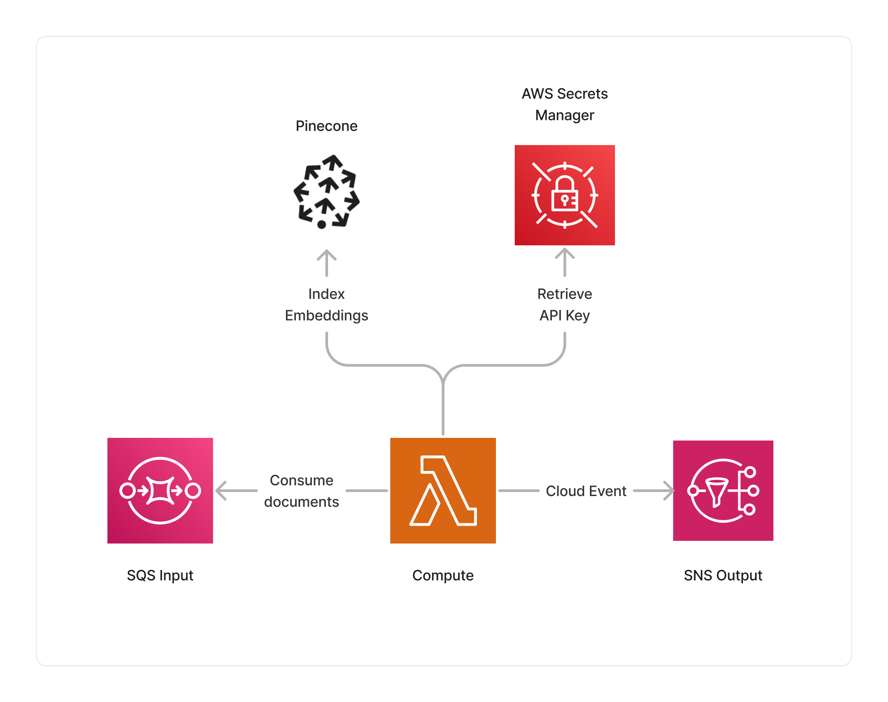

<span title="Label: Pro" data-view-component="true" class="Label Label--api text-uppercase">
  Unstable API
</span>
<span title="Label: Pro" data-view-component="true" class="Label Label--version text-uppercase">
  0.1.4
</span>
<span title="Label: Pro" data-view-component="true" class="Label Label--package">
  @project-lakechain/pinecone-storage-connector
</span>
<br>

---

The Pinecone storage connector makes it easy to index vector embeddings produced by other middlewares in a [Pinecone](https://www.pinecone.io/) Pod or Serverless index. This connector uses the [Pinecone TypeScript SDK](https://github.com/pinecone-io/pinecone-ts-client) to integrate embeddings associated with processed documents with your indexes, while respecting the Pinecone throttling limits.

---

### 🌲 Indexing Documents

To use the Pinecone storage connector, you import it in your CDK stack, and connect it to a data source providing document embeddings.

> 💁 You need to specify a Pinecone API key to the connector, by specifying a reference to an [AWS Secrets Manager](https://aws.amazon.com/secrets-manager/) secret containing the API key.

```typescript
import { PineconeStorageConnector } from '@project-lakechain/pinecone-storage-connector';
import { CacheStorage } from '@project-lakechain/core';

class Stack extends cdk.Stack {
  constructor(scope: cdk.Construct, id: string) {
    const cache = new CacheStorage(this, 'Cache');

    // The Pinecone API key.
    const pineconeApiKey = secrets.Secret.fromSecretNameV2(
      this,
      'PineconeApiKey',
      process.env.PINECONE_API_KEY_SECRET_NAME as string
    );

    // Create the Pinecone storage connector.
    const connector = new PineconeStorageConnector.Builder()
      .withScope(this)
      .withIdentifier('PineconeStorageConnector')
      .withCacheStorage(cache)
      .withSource(source) // 👈 Specify a data source
      .withApiKey(pineconeApiKey)
      .withIndexName('pinecone-index')
      .build();
  }
}
```

<br>

---

#### Namespaces

To specify a specific namespace in which document embeddings will be stored, you can use the `withNamespace` API.

> 💁 By default, the namespace is set to an empty string.

```typescript
const connector = new PineconeStorageConnector.Builder()
  .withScope(this)
  .withIdentifier('PineconeStorageConnector')
  .withCacheStorage(cache)
  .withSource(source)
  .withApiKey(pineconeApiKey)
  .withIndexName('pinecone-index')
  .withNamespace('my-namespace') // 👈 Specify a namespace
  .build();
```

<br>

---

#### Include Text

When the document being processed is a text, you can choose to include the text of the document associated with the embeddings in the Pinecone index. To do so, you can use the `withIncludeText` API. If the document is not a text, this option is ignored.

> 💁 By default, the text is not included in the index.

```typescript
const connector = new PineconeStorageConnector.Builder()
  .withScope(this)
  .withIdentifier('PineconeStorageConnector')
  .withCacheStorage(cache)
  .withSource(source)
  .withApiKey(pineconeApiKey)
  .withIndexName('pinecone-index')
  .withIncludeText(true) // 👈 Include text
  .build();
```

<br>

---

#### Controller Host

To specify a custom controller host, you can use the `withControllerHost` API.

```typescript
const connector = new PineconeStorageConnector.Builder()
  .withScope(this)
  .withIdentifier('PineconeStorageConnector')
  .withCacheStorage(cache)
  .withSource(source)
  .withApiKey(pineconeApiKey)
  .withIndexName('pinecone-index')
  .withControllerHostUrl('https://api.pinecone.io')
  .build();
```

<br>

---

### 🏗️ Architecture

This middleware is based on a Lambda ARM64 compute to perform the indexing of document embeddings from source middlewares into the destination Pinecone index. It also leverages AWS Secrets Manager to retrieve the Pinecone API key at runtime.



<br>

---

### 🏷️ Properties

<br>

##### Supported Inputs

|  Mime Type  | Description |
| ----------- | ----------- |
| `*/*` | This middleware supports any type of documents. Note that if no embeddings are specified in the document metadata, the document is filtered out. |

##### Supported Outputs

*This middleware does not produce any output.*

##### Supported Compute Types

| Type  | Description |
| ----- | ----------- |
| `CPU` | This middleware only supports CPU compute. |

<br>

---

### 📖 Examples

- [Bedrock + Pinecone Pipeline](https://github.com/awslabs/project-lakechain/tree/main/examples/simple-pipelines/embedding-pipelines/bedrock-pinecone-pipeline) - An example showcasing an embedding pipeline using Amazon Bedrock and Pinecone.
