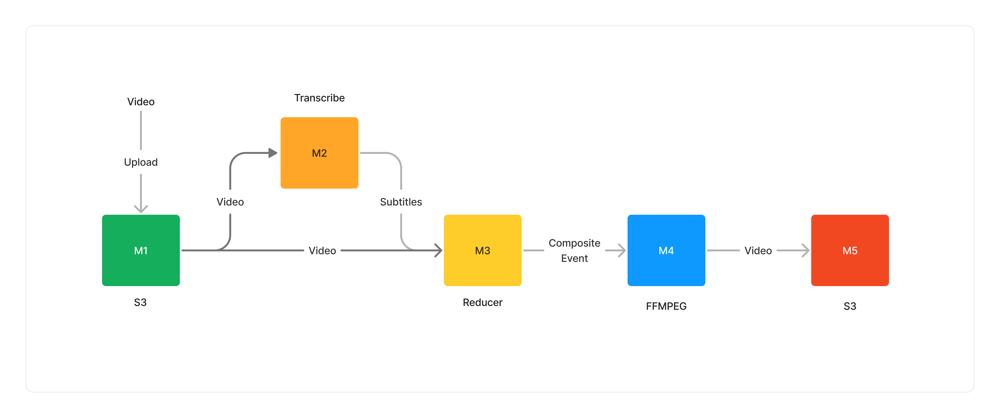
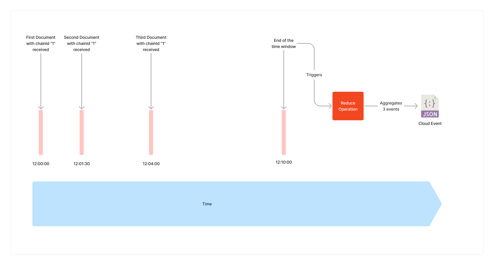
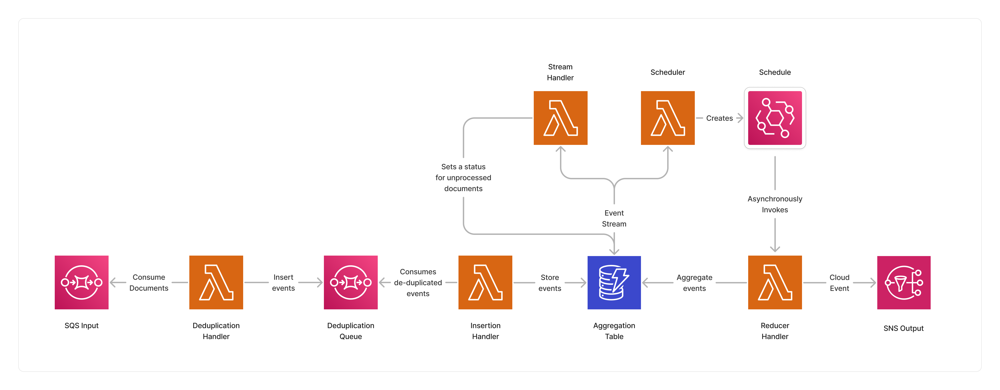
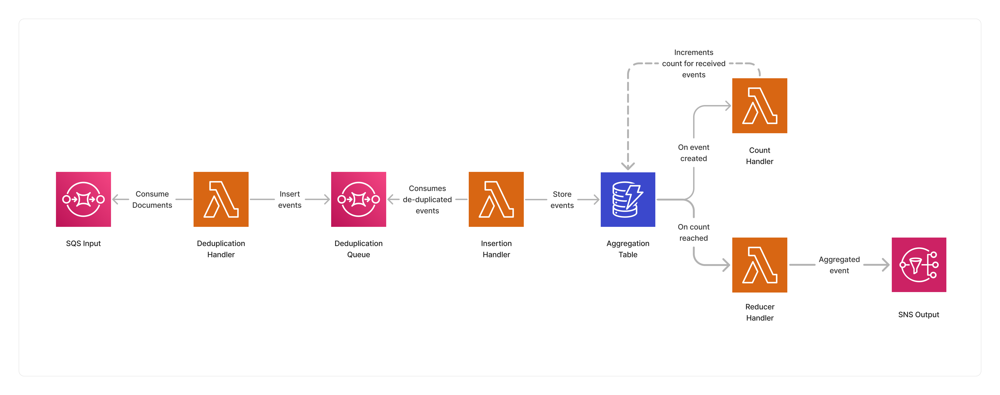

<span title="Label: Pro" data-view-component="true" class="Label Label--api text-uppercase">
  Unstable API
</span>
<span title="Label: Pro" data-view-component="true" class="Label Label--version text-uppercase">
  0.8.0
</span>
<span title="Label: Pro" data-view-component="true" class="Label Label--package">
  <a target="_blank" href="https://www.npmjs.com/package/@project-lakechain/reducer">
    @project-lakechain/reducer
  </a>
</span>
<span class="language-icon">
  <svg role="img" viewBox="0 0 24 24" width="30" xmlns="http://www.w3.org/2000/svg" style="fill: #3178C6;"><title>TypeScript</title><path d="M1.125 0C.502 0 0 .502 0 1.125v21.75C0 23.498.502 24 1.125 24h21.75c.623 0 1.125-.502 1.125-1.125V1.125C24 .502 23.498 0 22.875 0zm17.363 9.75c.612 0 1.154.037 1.627.111a6.38 6.38 0 0 1 1.306.34v2.458a3.95 3.95 0 0 0-.643-.361 5.093 5.093 0 0 0-.717-.26 5.453 5.453 0 0 0-1.426-.2c-.3 0-.573.028-.819.086a2.1 2.1 0 0 0-.623.242c-.17.104-.3.229-.393.374a.888.888 0 0 0-.14.49c0 .196.053.373.156.529.104.156.252.304.443.444s.423.276.696.41c.273.135.582.274.926.416.47.197.892.407 1.266.628.374.222.695.473.963.753.268.279.472.598.614.957.142.359.214.776.214 1.253 0 .657-.125 1.21-.373 1.656a3.033 3.033 0 0 1-1.012 1.085 4.38 4.38 0 0 1-1.487.596c-.566.12-1.163.18-1.79.18a9.916 9.916 0 0 1-1.84-.164 5.544 5.544 0 0 1-1.512-.493v-2.63a5.033 5.033 0 0 0 3.237 1.2c.333 0 .624-.03.872-.09.249-.06.456-.144.623-.25.166-.108.29-.234.373-.38a1.023 1.023 0 0 0-.074-1.089 2.12 2.12 0 0 0-.537-.5 5.597 5.597 0 0 0-.807-.444 27.72 27.72 0 0 0-1.007-.436c-.918-.383-1.602-.852-2.053-1.405-.45-.553-.676-1.222-.676-2.005 0-.614.123-1.141.369-1.582.246-.441.58-.804 1.004-1.089a4.494 4.494 0 0 1 1.47-.629 7.536 7.536 0 0 1 1.77-.201zm-15.113.188h9.563v2.166H9.506v9.646H6.789v-9.646H3.375z"/></svg>
</span>
<div style="margin-top: 26px"></div>

---

The `Reducer` middleware is an essential flow control mechanism of Project Lakechain, allowing developers to reduce a collection of documents into a single entity. It is a structural element of the framework making it possible to express [map-reduce](https://en.wikipedia.org/wiki/MapReduce) pipelines.

At its core, this middleware allows pipeline builders to group relevant documents into a single semantical envelope, and perform combined operations on them. In combination with other middlewares this unlocks many use-cases, for example, aggregating multiple audio files together to concatenate them, zip a collection of documents on-the-fly, or insert a set of subtitles into a video.

> The `Reducer` middleware can aggregate multiple documents based on specific strategies which we document below.

<br />

---

### 📘 Strategies

Strategies defines under which conditions you want to reduce documents together. There are two different strategies implemented by this middleware. But before diving into the strategies, let's first understand the concept of `chainId`.

#### Chain Ids

A `chainId` is a unique identifier part of [CloudEvents](/project-lakechain/general/events). It identifies a specific execution of a pipeline — sometimes referred to as a *chain*. This identifier remains stable for the entire lifecycle of a pipeline execution, across all middleware steps.

To illustrate this, let's picture a simple pipeline where we monitor videos uploaded to an S3 bucket. This pipeline creates subtitles for that video and then merges the subtitles back into the video. It might look like the following.



We say that a new pipeline execution is triggered when a new video is uploaded to the S3 bucket. This specific execution is identified by a `chainId` which remains the same across the `Transcribe`, `Reduce`, `FFMPEG` and `S3` steps. In a nutshell, it's a great way to follow the lifecycle of a document processing execution within a pipeline.

<br />

---

#### Time Windows

The time window strategy reduces events belonging to the same `chainId` within a user defined time window. The time window can be comprised between 1 second and 48 hours. When the time window reaches its end, the aggregated events are reduced into a single composite event, and forwarded to the next middlewares in the pipeline.

This strategy is a good fit for scenarios where you don't necessarily know how many documents will be produced by previous middlewares preceding the `Reducer` step.

It starts aggregating documents belonging to the same `chainId` when the first document with that identifier is received. For example, if your time window is set to 10 minutes, and the first document is received at 12:00, all documents received until 12:10 having the same `chainId` will be aggregated together and forwarded to the next middlewares.



##### Jitter

The `TimeWindowStrategy` allows you to optionally specify a jitter which consists of a random number between zero and an arbitrary value. Using a jitter can be useful to smoothen the aggregation process across multiple `chainId`.

For example, if your time window is 10 minutes, and you add a jitter of 30 seconds, each reduce operation will occur after 10 minutes + a random value comprised between zero and 30 seconds.

##### Unmatched Events

The time window strategy awaits for a time condition to be met. When the time window is reached, all aggregated documents are reduced. If documents with the same `chainId` are received after a reduce operation occurred, they will be dismissed.

##### Usage

To reduce events using the `TimeWindowStrategy`, you must import and instantiate the `Reducer` middleware as part of your pipeline.

> 💁 Below is an example showcasing how to instantiate the reducer using the `TimeWindowStrategy` with a time window of 15 seconds and a jitter of 5 seconds.

```typescript
import * as cdk from 'aws-cdk-lib';
import { Reducer, TimeWindowStrategy } from '@project-lakechain/reducer';

class Stack extends cdk.Stack {
  constructor(scope: cdk.Construct, id: string) {
    const reducer = new Reducer.Builder()
      .withScope(this)
      .withIdentifier('Reducer')
      .withCacheStorage(cache)
      .withSources([M1, M2, M3]) // 👈 Specifies data sources.
      .withReducerStrategy(new TimeWindowStrategy.Builder().
        .withTimeWindow(cdk.Duration.seconds(15))
        .withJitter(cdk.Duration.seconds(5))
        .build()
      )
      .build();
  }
}
```

<br />

---

#### Static Counter

The static counter strategy reduces all events belonging to the same `chainId`, based on a static counter. It allows you to specify the number of documents to aggregate together before reducing them into a single event.

This strategy is a good fit when you know the exact number of documents that you expect to be reduced.

For example, let's say that you want to translate a document in french, english, and spanish using the [Translate Text Processor](/project-lakechain/text-processing/translate-text-processor), and reduce the translated documents back together to zip them. In this case, you know that you will be expecting exactly 3 documents associated with the translated languages.

##### Unmatched Events

As the reducer awaits for the static count condition to be met, it will aggregate documents for a period of up to 48 hours. If the counter is not reached after this period, the aggregated documents will be dismissed.

Similarly, if a reduce operation already occurred for a given chain identifier, any subsequent document that may arrive after the count condition has been met will be dismissed.

##### Usage

To reduce events using the `StaticCounterStrategy`, you must import and instantiate the `Reducer` middleware as part of your pipeline.

> 💁 Below is an example showcasing how to instantiate the reducer using the `StaticCounterStrategy` with a counter of 3.

```typescript
import * as cdk from 'aws-cdk-lib';
import { Reducer, StaticCounterStrategy } from '@project-lakechain/reducer';

class Stack extends cdk.Stack {
  constructor(scope: cdk.Construct, id: string) {
    const reducer = new Reducer.Builder()
      .withScope(this)
      .withIdentifier('Reducer')
      .withCacheStorage(cache)
      .withSources([M1, M2, M3]) // 👈 Specifies the sources.
      .withReducerStrategy(new StaticCounterStrategy.Builder()
        .withEventCount(3)
        .build()
      )
      .build();
  }
}
```

<br />

---

#### Conditional Strategy

The conditional strategy reduces events based on a custom user-provided condition. It allows you to define a [funclet](/project-lakechain/guides/funclets) or a lambda function that gets called back when a new document belonging to a given `chainId` is being aggregated. This conditional expression defines when the aggregated events should be reduced.

This strategy is a good fit when you want to control the reduce process based on a specific condition. For example, let's say that you want to reduce a collection of events based on the metadata of the documents, or even based on a third-party API, you can use the conditional strategy to do that.

##### Unmatched Events

This strategy allows you to evaluate each aggregated document for a duration of up to 48 hours. If the condition is unmet after this period, the aggregated documents will be dismissed.

If a reduce operation already occurred for a given chain identifier, any subsequent document that may arrive after the condition has been met, and having the same chain identifier, will be dismissed.

##### Usage

To reduce events using the `ConditionalStrategy`, you must import and instantiate the `Reducer` middleware as part of your pipeline.

> 💁 Below is an example showcasing how to instantiate the reducer using the `ConditionalStrategy` with a custom condition.

```typescript
import * as cdk from 'aws-cdk-lib';
import { CloudEvent, TextMetadata } from '@project-lakechain/sdk';
import { Reducer, ConditionalStrategy } from '@project-lakechain/reducer';

/**
 * This conditional expression is called by the reducer middleware
 * for every new received event. In this example, we want to reduce
 * the events based on the total number of chunks produced by the
 * previous middlewares.
 * @param events the event to process.
 * @param storedEvents the list of events stored in the table.
 * @returns a promise resolving to a boolean value.
 */
export const conditional = async (event: CloudEvent, storedEvents: CloudEvent[]) => {
  const metadata = event.data().metadata().properties?.attrs as TextMetadata;

  // Return a boolean value.
  return (storedEvents.length === metadata.chunk?.total);
};

class Stack extends cdk.Stack {
  constructor(scope: cdk.Construct, id: string) {
    const reducer = new Reducer.Builder()
      .withScope(this)
      .withIdentifier('Reducer')
      .withCacheStorage(cache)
      .withSources([M1, M2, M3]) // 👈 Specifies the sources.
      .withReducerStrategy(new ConditionalStrategy.Builder()
        .withConditional(conditional)
        .build()
      )
      .build();
  }
}
```

##### Funclet Signature

Funclet expressions use the power of a full programming language to express complex reduce conditional expressions. They are asynchronous and can be defined as TypeScript named functions, anonymous functions, or arrow functions.

A reduce conditional funclet takes 2 arguments. A CloudEvent describing the document that is being handled by the reducer, and a collection of the stored events up until now — excluding the received event. It must return a promise to a boolean value representing the result of the evaluation, true if the reduce operation should occur, false otherwise.

```typescript
type ConditionalExpression = (event: CloudEvent, storedEvents: CloudEvent[]) => Promise<boolean>;
```

<br />

---

### 🏗️ Architecture

The architecture implemented by this middleware depends on the selected strategy. Below is a description of the architecture implemented by each strategy.

#### `TimeWindowStrategy`

This strategy implements a serverless aggregation architecture based on DynamoDB for document event aggregation, and the [EventBridge Scheduler](https://docs.aws.amazon.com/scheduler/latest/UserGuide/what-is-scheduler.html) service for scheduling the execution of the reducer for each `chainId` group of events when the time window is reached.



#### `StaticCounterStrategy`

This strategy also implements a serverless aggregation architecture based on DynamoDB as the document aggregator, and leverages an event-driven approach to count the number of documents received for a specific `chainId` using DynamoDB streams.



#### `ConditionalStrategy`

The conditional strategy implements a serverless aggregation architecture based on DynamoDB as the document aggregator, and leverages an event-driven approach to evaluate a conditional expression for each received document belonging to the same `chainId`.


<br />

---

### 🏷️ Properties

<br />

##### Supported Inputs

| Mime Type | Description |
| --------- | ----------- |
| `*/*`     | The reducer middleware can consume any type of document. |

##### Supported Outputs

| Mime Type                      | Description |
| ------------------------------ | ----------- |
| `application/cloudevents+json` | Composite event. |

##### Supported Compute Types

| Type  | Description |
| ----- | ----------- |
| `CPU` | This middleware only supports CPU compute. |

<br />

---

### 📖 Examples

- [Building a Generative Podcast](https://github.com/awslabs/project-lakechain/tree/main/examples/end-to-end-use-cases/building-a-podcast-generator) - Builds a pipeline for creating a generative weekly AWS news podcast.
- [Building a Video Chaptering Service](https://github.com/awslabs/project-lakechain/tree/main/examples/end-to-end-use-cases/building-a-video-chaptering-service) - Builds a pipeline for automatic video chaptering generation.
- [Bedrock Translation Pipeline](https://github.com/awslabs/project-lakechain/tree/main/examples/simple-pipelines/text-translation-pipelines/bedrock-translation-pipeline) - Translates documents using a large-language model hosted on Amazon Bedrock.
