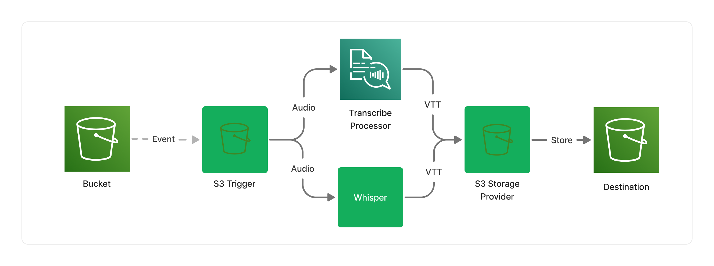
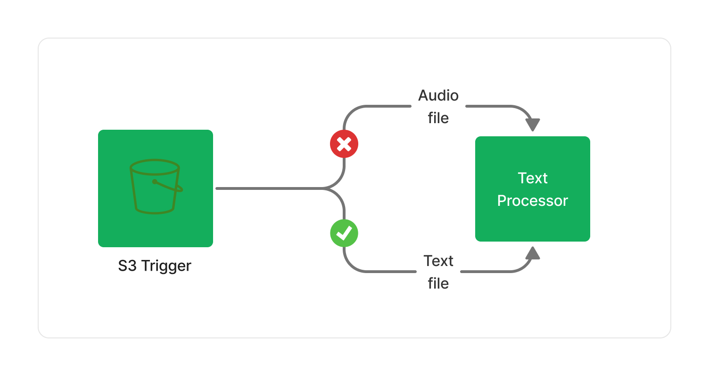

## 🏗 Pipelines

Project Lakechain articulates around the concept of *pipelines* which are the unit of execution of any document processing job. Pipelines get executed by *triggers* based on document events emitted by a data source. For example, you can declare a pipeline that is triggered every time you upload a new document on an S3 bucket by using the [S3 Trigger](/triggers/s3-event-trigger).

Each pipeline can be composed of one or many components that we call *middlewares*. Each middleware in a pipeline can perform actions on documents, such as analyzing the document to extract metadata, or apply transformations on that document. They provide the foundation for composing complex pipelines, and the freedom to developers to interchange between different middlewares to quickly create experiments and A/B test different approaches to compare their performance and accuracy.

### Your First Pipeline

Let's say you want to create an audio transcription pipeline that takes audio recordings as an input, and produces structured text transcriptions as an output. With Lakechain you can compose your pipeline by leveraging the [Transcribe Audio Processor](/audio-processing/transcribe-audio-processor) middleware to do just that.

In the above pipeline, the **Transcribe Audio Processor** leverages [Amazon Transcribe](https://aws.amazon.com/transcribe/) to automatically schedule transcription jobs, and seamlessly transform input audio files as [WebVTT](https://en.wikipedia.org/wiki/WebVTT) subtitles. The WebVTT file is then handed to the **S3 Storage Provider** middleware that stores the result in an S3 bucket destination.

> ℹ️ Lakechain supports a variety of storage providers, allowing you to integrate the result of your pipelines with different data stores.

### Going Further

Our first pipeline is quite straight and sequential in its layout, but we can in fact shape pipelines as any [Directed Acyclic Graph (DAG)](https://en.wikipedia.org/wiki/Directed_acyclic_graph). Let's say that you are happy with your first pipeline, but would like to compare the results with another model. It turns out, Lakechain has another middleware for performing audio transcriptions based on the [OpenAI Whisper](https://github.com/openai/whisper) model.

We can declare a pipeline that will *map* our audio file to both middlewares, and execute both transcription jobs in parallel. We then store the result of transcription jobs in S3.

 

---

## 🤖 Middlewares

As showcased in the previous section, middlewares are the building blocks for pipelines. We like to think of pipelines as *distributed pipes* that you would typically use within your terminal, and middlewares as the commands you pipe the output of, to the input of the next one, each command doing only one thing, but doing it well!

> ℹ️ The Lakechain project comes with 40+ built-in middlewares for common document processing use-cases that you can assemble in your own pipelines.

### I/O Types

Every middleware declares a set of supported input and output types expressed as standard [Multipurpose Internet Mail Extensions (MIME)](https://en.wikipedia.org/wiki/MIME) types. The type of documents that a middleware supports as an input, and can produce as an output, is known by Lakechain at *deployment-time*.

This allows Lakechain to raise deployment-time exceptions if you connect middlewares that don't have overlapping input and output types, the same way a typed programming language would prevent you to compile your code if you try to pass an unsupported type to a function or method.

Some middlewares, such as the [S3 Trigger](/triggers/s3-event-trigger) may declare a *variant* as an output type, because customers can store *any* type of document into an S3 bucket. In those cases, only middlewares that support the concrete type of the document — known at runtime — will be triggered. This filtering makes your middlewares type-safe in any situation, thus preventing potential errors and unnecessary costs.

### Compute Types

Each middleware is effectively designed as an isolated micro-service that customers can assemble in a pipeline and scale independently. In fact, every middleware can have its own bespoke internal architecture as long as it implements the input and output interface required to connect it with other middlewares.

While Lakechain puts a strong emphasis on serverless and event-driven architectures, a middleware can use any compute type to perform its own document processing work, would it be a Lambda function, a Fargate container, or a Sagemaker endpoint, giving the freedom to developers to use the right tool for the job.

To drive the right balance between performance and costs, Lakechain allows pipeline builders to provide hints to middlewares as to what compute type they should use. There are 3 supported compute types you can pass as hints to middleware instances:

- **CPU** - Attempt to place the middleware on a CPU compute.
- **GPU** - Attempt to place the middleware on a GPU instance, typically leveraging AWS ECS GPU instances.
- **ACCELERATOR** - Attempt to place the middleware on an accelerated compute such as [AWS Inferentia 2](https://aws.amazon.com/ec2/instance-types/inf2/).

Not all middlewares support hybrid compute types, nor does it make sense for all middlewares to be able to run across all compute types. Therefore, Lakechain will trigger an exception at deployment-time if it detects that a given compute type hint is not compatible with the way a middleware is implemented.
