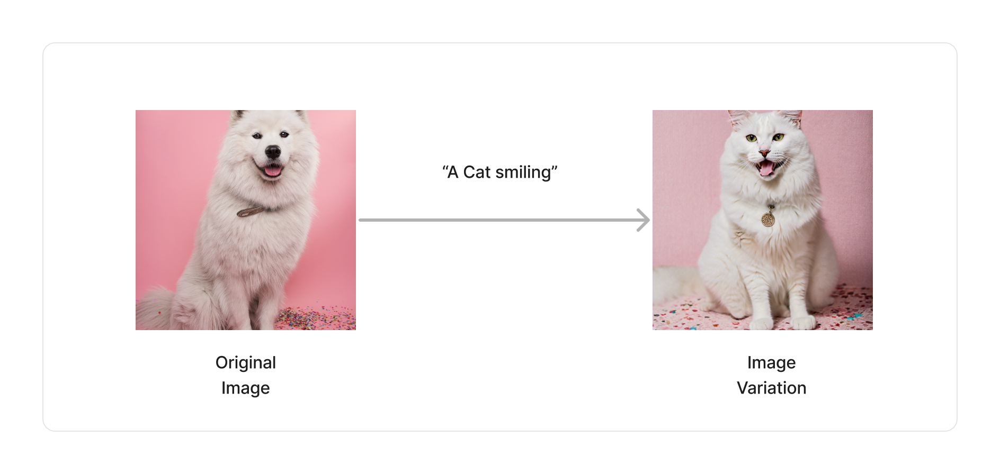
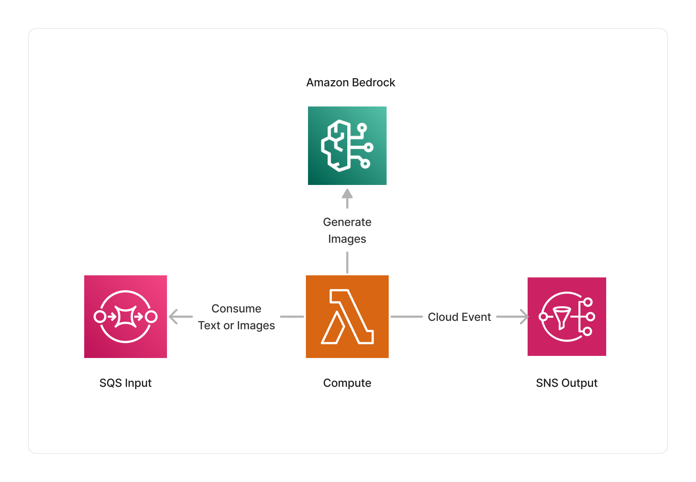

<span title="Label: Pro" data-view-component="true" class="Label Label--api text-uppercase">
  Unstable API
</span>
<span title="Label: Pro" data-view-component="true" class="Label Label--version text-uppercase">
  0.4.0
</span>
<span title="Label: Pro" data-view-component="true" class="Label Label--package">
  <a target="_blank" href="https://www.npmjs.com/package/@project-lakechain/bedrock-image-generators">
    @project-lakechain/bedrock-image-generators
  </a>
</span>
<span class="language-icon">
  <svg role="img" viewBox="0 0 24 24" width="30" xmlns="http://www.w3.org/2000/svg" style="fill: #3178C6;"><title>TypeScript</title><path d="M1.125 0C.502 0 0 .502 0 1.125v21.75C0 23.498.502 24 1.125 24h21.75c.623 0 1.125-.502 1.125-1.125V1.125C24 .502 23.498 0 22.875 0zm17.363 9.75c.612 0 1.154.037 1.627.111a6.38 6.38 0 0 1 1.306.34v2.458a3.95 3.95 0 0 0-.643-.361 5.093 5.093 0 0 0-.717-.26 5.453 5.453 0 0 0-1.426-.2c-.3 0-.573.028-.819.086a2.1 2.1 0 0 0-.623.242c-.17.104-.3.229-.393.374a.888.888 0 0 0-.14.49c0 .196.053.373.156.529.104.156.252.304.443.444s.423.276.696.41c.273.135.582.274.926.416.47.197.892.407 1.266.628.374.222.695.473.963.753.268.279.472.598.614.957.142.359.214.776.214 1.253 0 .657-.125 1.21-.373 1.656a3.033 3.033 0 0 1-1.012 1.085 4.38 4.38 0 0 1-1.487.596c-.566.12-1.163.18-1.79.18a9.916 9.916 0 0 1-1.84-.164 5.544 5.544 0 0 1-1.512-.493v-2.63a5.033 5.033 0 0 0 3.237 1.2c.333 0 .624-.03.872-.09.249-.06.456-.144.623-.25.166-.108.29-.234.373-.38a1.023 1.023 0 0 0-.074-1.089 2.12 2.12 0 0 0-.537-.5 5.597 5.597 0 0 0-.807-.444 27.72 27.72 0 0 0-1.007-.436c-.918-.383-1.602-.852-2.053-1.405-.45-.553-.676-1.222-.676-2.005 0-.614.123-1.141.369-1.582.246-.441.58-.804 1.004-1.089a4.494 4.494 0 0 1 1.47-.629 7.536 7.536 0 0 1 1.77-.201zm-15.113.188h9.563v2.166H9.506v9.646H6.789v-9.646H3.375z"/></svg>
</span>
<div style="margin-top: 26px"></div>

---

The Bedrock image generators package enables developers to use image generation models hosted on [Amazon Bedrock](https://docs.aws.amazon.com/bedrock/latest/userguide/what-is-bedrock.html), and create images at scale within their pipelines. The Amazon Titan image generator is part of this package and makes it possible to generate images from text, realize image inpainting and outpainting, as well as image-to-image variation.

---

### 🖼️ Text-to-Image

To generate images as part of your pipelines from a text prompt, you can use the `TitanImageGenerator` construct. This construct either takes the content of input text document as a prompt for generating an image, allowing you to nicely chain documents together, or can also take a user-provided prompt.

> ℹ️ The below example demonstrates how to use the Titan image generator to create images from an arbitrary prompt every 5 minutes, using the [Scheduler Trigger](/project-lakechain/triggers/scheduler-event-trigger).

```typescript
import * as scheduler from '@aws-cdk/aws-scheduler-alpha';
import { SchedulerEventTrigger } from '@project-lakechain/scheduler-event-trigger';
import { SdxlImageGenerator } from '@project-lakechain/bedrock-image-generators';

class Stack extends cdk.Stack {
  constructor(scope: cdk.Construct, id: string) {
    const trigger = new SchedulerEventTrigger.Builder()
      .withScope(this)
      .withIdentifier('Trigger')
      .withScheduleExpression(
        scheduler.ScheduleExpression.rate(cdk.Duration.minutes(5))
      )
      .build();

    // Every 5 minutes, generate a new image.
    trigger.pipe(new TitanImageGenerator.Builder()
      .withScope(this)
      .withIdentifier('TitanImageGenerator')
      .withCacheStorage(cache)
      .withSource(trigger)
      .withTask(new TextToImageTask.Builder()
        .withPrompt('A beautiful sunset over the ocean.')
        .withNegativePrompt('low resolution, low quality')
        .build()
      )
      .build());
  }
}
```

<br />
<br />

---

### 🧑‍🎨 Image Inpainting

The Titan model supports image inpainting by painting with an AI generated image an area of an image delimited by a *mask*.


To implement inpainting within a pipeline, you can use the `TitanImageGenerator` by specifying a source image
and a mask prompt. Mask prompts identify the area to be painted in natural language, such as "house" or "window".

> 💁 In the below example we create a pipeline that triggers when an image is uploaded to a source S3 bucket,
and replace any *house* detected in the image by a "*Modern house*".

```typescript
import { TitanImageGenerator, ImageInpaintingTask } from '@project-lakechain/bedrock-image-generators';

const imageGenerator = new TitanImageGenerator.Builder()
  .withScope(this)
  .withIdentifier('ImageGenerator')
  .withCacheStorage(cache)
  .withSource(source) // 👈 Specify a data source.
  .withTask(new ImageInpaintingTask.Builder()
    .withTextPrompt('Modern house')
    .withMaskPrompt('house')
    .build()
  )
  .build()
```

<br />
<br />

---

### 🎨 Image Outpainting

The Amazon Titan image model also supports outpainting, relative to a mask prompt. Image outpainting refers to painting an existing image outside of the area delimited by the mask image.


> 💁 In the below example we create a pipeline that triggers when an image is uploaded to a source S3 bucket,
and replaces the environment outside of a *house* with a "*beautiful garden and swimming pool*".

```typescript
import { TitanImageGenerator, ImageOutpaintingTask } from '@project-lakechain/bedrock-image-generators';

const imageGenerator = new TitanImageGenerator.Builder()
  .withScope(this)
  .withIdentifier('ImageGenerator')
  .withCacheStorage(cache)
  .withSource(source) // 👈 Specify a data source.
  .withTask(new ImageOutpaintingTask.Builder()
    .withTextPrompt('Beautiful garden and swimming pool')
    .withMaskPrompt('house')
    .build()
  )
  .build();
```

<br />
<br />

---

### ✨ Image Variation

The Titan model also supports taking an image as an input, and transforming that image using a textual prompt into a new image.



To perform image variation, you use the `TitanImageGenerator` and provide it with a `ImageVariationTask`.

```typescript
import { TitanImageGenerator, ImageVariationTask } from '@project-lakechain/bedrock-image-generators';

const imageGenerator = new TitanImageGenerator.Builder()
  .withScope(this)
  .withIdentifier('ImageGenerator')
  .withCacheStorage(cache)
  .withSource(trigger)
  .withSource(source) // 👈 Specify a data source.
  .withTask(new ImageVariationTask.Builder()
    .withTextPrompt('A cat smiling')
    // Reference the current document in the pipeline.
    .withImage(r.reference(r.document()))
    .build()
  )
  .build();
```

<br />
<br />

---

### 🌐 Region Selection

You can specify the AWS region in which you want to invoke Amazon Bedrock using the `.withRegion` API.

> 💁 By default, the middleware will use the current region in which it is deployed.

```typescript
import { TitanImageGenerator } from '@project-lakechain/bedrock-image-generators';

const imageGenerator = new TitanImageGenerator.Builder()
  .withScope(this)
  .withIdentifier('ImageGenerator')
  .withCacheStorage(cache)
  .withSource(trigger)
  .withRegion('us-east-1') // 👈 Alternate region
  .withTask(task)
  .build();
```

<br />
<br />

---

### ⚙️ Model Parameters

For the different tasks supported by the `TitanImageGenerator`, you can specify additional parameters to customize the generation of the images. You pass additional parameters using the `.withImageGenerationParameters` API on the task to execute.

```typescript
import {
  TitanImageGenerator,
  ImageOutpaintingTask,
  ImageGenerationParameters
} from '@project-lakechain/bedrock-image-generators';

const imageGenerator = new TitanImageGenerator.Builder()
  .withScope(this)
  .withIdentifier('ImageGenerator')
  .withCacheStorage(cache)
  .withSource(source)
  .withTask(new ImageOutpaintingTask.Builder()
    .withTextPrompt('Beautiful garden and swimming pool')
    .withMaskPrompt('house')
    .withImageGenerationParameters(new ImageGenerationParameters.Builder()
      .withQuality('premium')
      .withNumberOfImages(10)
      .build()
    )
    .build()
  )
  .build();
```

<br />

#### Parameters

Below are the parameters you can pass to the image generation tasks. See the [official Titan documentation](https://docs.aws.amazon.com/bedrock/latest/userguide/model-parameters-titan-image.html) to understand the effect of available parameters.

| Parameter | Description | Default |
| --------- | ----------- | ------- |
| `numberOfImages` | The number of images to generate. | 1 |
| `quality` | The quality of the generated images. | standard |
| `cfgScale` | Specifies how strongly the generated image should adhere to the prompt. | 8.0 |
| `height` | The height of the generated image. | 1024 |
| `width` | The width of the generated image. | 1024 |
| `seed` | Determines the initial noise setting. | 0 |

<br />
<br />

---

### 🏗️ Architecture

This middleware is based on a Lambda compute and interacts with the Amazon Bedrock service in the specified
region to generate images.



<br />

---

### 🏷️ Properties

<br>

##### Supported Inputs

|  Mime Type  | Description |
| ---------- | ----------- |
| `text/plain` | Text document |
| `image/png` | Image document |
| `image/jpeg` | Image document | 
| `application/json+scheduler` | Scheduler event |

##### Supported Outputs

|  Mime Type  | Description |
| ----------- | ----------- |
| `image/png` | Image document |

##### Supported Compute Types

| Type  | Description |
| ----- | ----------- |
| `CPU` | This middleware only supports CPU compute. |

<br />

---

### 📖 Examples

- [Titan Inpainting Pipeline](https://github.com/awslabs/project-lakechain/tree/main/examples/simple-pipelines/image-inpainting-pipelines/amazon-titan-inpainting-pipeline) - An example showcasing how to perform image inpainting using Amazon Titan.
- [Image Outpainting Pipeline](https://github.com/awslabs/project-lakechain/tree/main/examples/simple-pipelines/image-outpainting-pipeline) - An example showcasing how to perform image outpainting using Amazon Titan.
