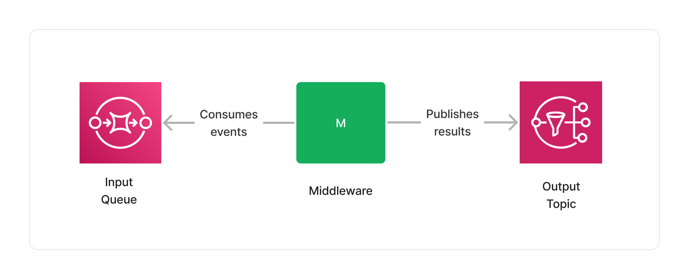
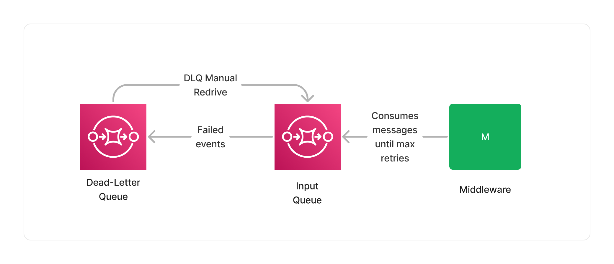
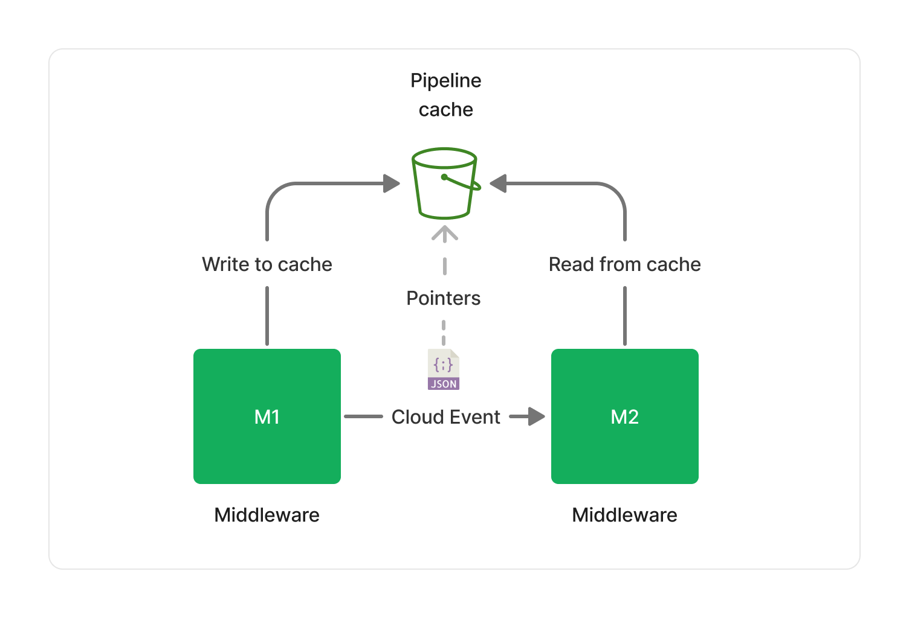

To provide a high-throughput and distributed computing foundation for processing documents, Project Lakechain builds on top of different AWS services and architectural patterns that we describe in this section.

## 📨 Messaging

The heart of Project Lakechain lies in its messaging system, allowing middlewares to process documents and communicate with each other. To model DAGs in Lakechain, we built on top of a solid foundation, leveraging [AWS SQS](https://aws.amazon.com/sqs/) and [AWS SNS](https://aws.amazon.com/sns/).

As seen in the [Concepts](/project-lakechain/general/concepts) section, each middleware exposes an input for handling documents to process, and an output to publish the result of a processing job. In fact, each input is modeled as an SQS queue, and each output as an SNS topic.

This simple design unlocks many opportunities, that we will explore in the following sections.

 

---

### Scale

Lakechain uses SQS and SNS for their highly scalable and low-latency nature. They both support a nearly unlimited number of messages in terms of throughput, and can scale to meet the demands of any processing workload.

> ℹ️ To provide a perspective of the scale of SQS, in 2023 during Prime day, Amazon.com has set a new traffic record by processing [86 million messages per second](https://aws.amazon.com/blogs/aws/prime-day-2023-powered-by-aws-all-the-numbers/) at peak using SQS.

 

---

### Integration

Another advantage of such an architecture is the native integration that exists between SNS and SQS, making it possible to defer to SNS the responsibility to deliver messages to the next middlewares input queues, while handling retries and throttling.

This both reduces the integration complexity and the need for developers to write boilerplate code, while benefiting from tight IAM permissions and the integration of SNS with CloudWatch and X-Ray for observability purposes.

Furthermore, because SQS and SNS are integrated with the [AWS SDK](https://aws.amazon.com/developer/tools/), it is possible to use virtually any type of compute in a middleware. Whether using Docker containers implementing a consumer-producer pattern on ECS, EKS or Fargate, using Lambda function using [Event-Source mappings](https://docs.aws.amazon.com/lambda/latest/dg/invocation-eventsourcemapping.html), or even plain EC2 instances.

 

---

### Error Handling

A very important part of processing documents is being able to monitor and handle failures. Lakechain uses SQS to automatically retry the processing of a document in case of a failure for a configurable amount of retries.

When a middleware fails to successfully process a document within the retry limits, the event associated with that document is stored in the middleware's input dead-letter queue. Customers can monitor dead-letter queues for failures, and retry an entire batch of failed processing events using a [dead-letter queue redrive](https://docs.aws.amazon.com/AWSSimpleQueueService/latest/SQSDeveloperGuide/sqs-configure-dead-letter-queue-redrive.html).

 

---

### Throttling

A common problem that arises when processing documents at scale comes from the integration with downstream services. Whether a middleware uses an external API to process documents, or a database to fetch or write results, it is important to be able to control the rate at which they interact with these services to stay within their limits.

As SQS implements a pull model, it is easy to control the rate at which middlewares consume messages from their input queue, while ensuring that downstream services don't get overwhelmed. For example, middlewares using Lambda can specify a [maximum concurrency](https://aws.amazon.com/blogs/compute/introducing-maximum-concurrency-of-aws-lambda-functions-when-using-amazon-sqs-as-an-event-source/) to control the number of concurrent functions that can be invoked to process documents, while other types of compute can manually control the rate at which they pull from their input queue.

> ℹ️ Lakechain uses a 14-day retention period for SQS queues, providing a big enough buffer for highly throttled workloads.

 

---

### Batch Processing

For some use-cases, it can be more efficient to process documents in batches rather than sequentially. SQS allows middlewares to consume up to 10 messages at once from their input queue.

For middlewares based on Lambda, it gets even better, as the Lambda service enables middlewares to consume events in even larger batches using a Batch Window of up to 5 minutes, allowing to process [up to 10,000 messages](https://docs.aws.amazon.com/lambda/latest/dg/with-sqs.html#events-sqs-eventsource) in a single execution.

 

---

### Fan-out

Complex DAGs might require a middleware to publish the result of a processing job to multiple middlewares, for example when parallelizing a pipeline, or creating branches in the context of an A/B test. In such contexts, SNS makes it easy to fan-out (we also say *map*) events from one, to many middlewares.

This design makes it possible to model complex DAGs, while keeping the integration between middlewares simple and scalable.

 

---

### Filtering

In the [concepts](/project-lakechain/general/concepts) section, we mentioned that middlewares can declare the types of documents they support, and additional conditionals that have to be met before they are invoked. This is made possible by using [SNS filtering](https://docs.aws.amazon.com/sns/latest/dg/sns-message-filtering.html), where Lakechain automatically *compiles* at deployment-time constraints declared by each middleware into a set of SNS filtering policies that get applied at runtime.

This is the reason why a middleware that only supports images, is not invoked when another type of document triggers a pipeline.

 

---

### Cost

Last, but definitely not least, this messaging design has been selected because of its very low cost. At **1.20$ per million** exchanged messages between middlewares, this messaging model provides a very cost-effective pay-as-you-go pricing.

The 1.20$/million message exchanged calculation goes as follow :
0.40$ per million SQS [SendMessage](https://docs.aws.amazon.com/AWSJavaScriptSDK/latest/AWS/SQS.html#sendMessage-property) actions + 0.40$ per million SQS [ReceiveMessage](https://docs.aws.amazon.com/AWSJavaScriptSDK/latest/AWS/SQS.html#receiveMessage-property) action for receiving each message exchanged across middlewares + 0.40$ per million SQS [DeleteMessage](https://docs.aws.amazon.com/AWSJavaScriptSDK/latest/AWS/SQS.html#deleteMessage-property) action for deleting each message after processing.

> ⚠️ Please note that this cost calculation only applies to messages exchanged between middlewares, and does not include the cost of running the compute associated with each middleware.

 

---

## 🗂️ Caching

Each middleware only gets read access to the document made available to it by previous middlewares. However,
[pointers](/project-lakechain/general/events/#using-pointers) that are parts of a document event need to be accessible by all middlewares across a pipeline.

To allow middlewares access pointers referenced in a document event, a distributed cache is provided to each middlewares part of the same pipeline. The cache is implemented on top of S3 ([Standard Class](https://aws.amazon.com/s3/storage-classes/)) and provides a cost-efficient, scalable, low-latency and high-throughput solution for storing and retrieving pointers when needed.

The cache storage is attached to an [S3 Lifecycle Policy](https://docs.aws.amazon.com/AmazonS3/latest/userguide/object-lifecycle-mgmt.html) that automatically deletes objects after 24 hours, ensuring that we keep the cost of the cache storage low.

