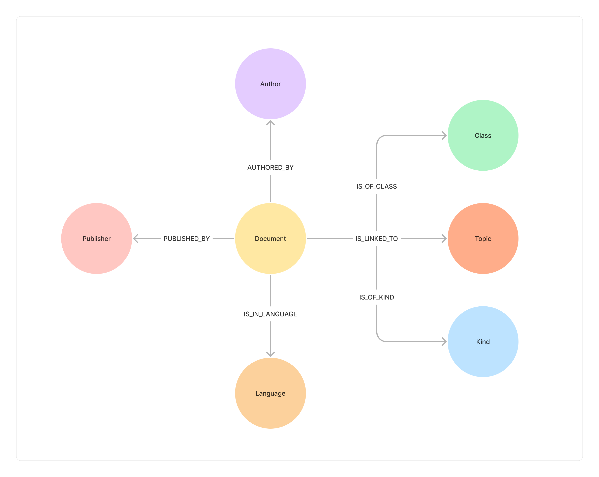

In the [Events](/project-lakechain/general/events) section, we've introduced the structure of an event and of a document along with its metadata, and their associated semantics. While events describe documents as relatively flat objects with their attributes, Project Lakechain also describes how documents can be defined as an ontology that describes the relationships between them and their attributes as an ontology graph.

 

---

## 🕸️ Structure

A document is described as part of the [CloudEvent](/project-lakechain/general/events) specification which is the ubiquitous language that describes documents and binds all middlewares together. This makes it possible to decouple middlewares from each other, while having them being naturally compatible as they speak the same language.

> 💁 A CloudEvent carries well-defined semantics which can be described as a semantic graph. Below is a description of the semantic relationship associated with a CloudEvent.

This ontology makes it simple to describe a document and its semantic relationships and is used by several middlewares such as the Semantic Ontology Extractor to express documents and store them in a graph database.
