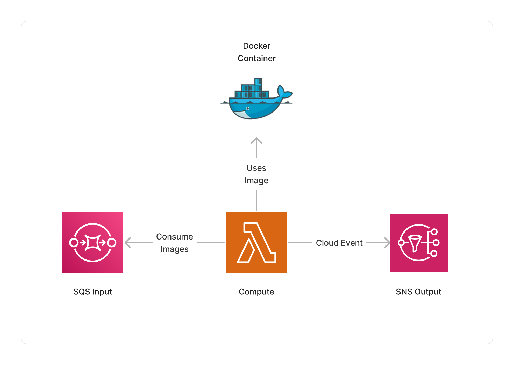

<span title="Label: Pro" data-view-component="true" class="Label Label--api text-uppercase">
  Unstable API
</span>
<span title="Label: Pro" data-view-component="true" class="Label Label--version text-uppercase">
  0.1.0
</span>
<span title="Label: Pro" data-view-component="true" class="Label Label--package">
  @project-lakechain/image-layer-processor
</span>
<br>

---

The image layer processor middleware provides the capability to draw layers on top of images. It makes it possible to use images semantic metadata generated by upstream middlewares to draw bounding boxes, blur areas such as text or objects, etc.

---

### 🖊️ Highlight Areas

In the below example, we are coupling the [Rekognition Image Processor](/image-processing/rekognition-image-processor) middleware with the image layer processor to draw bounding boxes around detected faces in an image.

> 💁 The image layer processor uses the information provided by the Rekognition image processor to determine around which area to draw the bounding boxes.

```typescript
import { RekognitionImageProcessor, dsl as r } from '@project-lakechain/rekognition-image-processor';
import { ImageLayerProcessor, dsl as l } from '@project-lakechain/image-layer-processor';
import { CacheStorage } from '@project-lakechain/core';

class Stack extends cdk.Stack {
  constructor(scope: cdk.Construct, id: string) {
    const cache = new CacheStorage(this, 'Cache');

    // Create the Rekognition image processor.
    const rekognitionProcessor = new RekognitionImageProcessor.Builder()
      .withScope(this)
      .withIdentifier('ImageProcessor')
      .withCacheStorage(cache)
      .withSource(source)
      .withIntent(
        r.detect().faces(r.confidence(80)) // 👈 Face detection
      )
      .build();

    // Create the image layer processor.
    const layerProcessor = new ImageLayerProcessor.Builder()
      .withScope(this)
      .withIdentifier('LayerProcessor')
      .withCacheStorage(cache)
      .withSource(rekognitionProcessor)
      .withLayers(
        l.highlight(l.faces()) // 👈 Highlight faces
      )
      .build();
  }
}
```

<br>

---

#### Examples

<br>

| Face Highlighting  | Object Highlighting  |
| ------------------ | -------------------  |
|  |  |

<br>

---

#### Operations

Below is a list of subjects that the `highlight` operation supports and that follow the same logic as in the previous example. These subjects are used to highlight different areas of the image, and expect upstream middlewares to provide the necessary semantic metadata to do so.

| Subject | Description |
| ------- | ----------- |
| `faces` | Highlight faces on the image. |
| `objects` | Highlight objects on the image. |
| `text` | Highlight text on the image. |
| `landmarks` | Highlight face landmarks on the image. |

<br>

---

### 👾 Pixelate

Another drawing operation supported by this middleware is its ability to pixelate areas of images based on semantic metadata provided by upstream middlewares.

> 💁 In the below example, we are blurring the faces detected from images.

```typescript
import { RekognitionImageProcessor, dsl as r } from '@project-lakechain/rekognition-image-processor';
import { ImageLayerProcessor, dsl as l } from '@project-lakechain/image-layer-processor';
import { CacheStorage } from '@project-lakechain/core';

class Stack extends cdk.Stack {
  constructor(scope: cdk.Construct, id: string) {
    const cache = new CacheStorage(this, 'Cache');

    // Create the Rekognition image processor.
    const rekognitionProcessor = new RekognitionImageProcessor.Builder()
      .withScope(this)
      .withIdentifier('ImageProcessor')
      .withCacheStorage(cache)
      .withSource(source)
      .withIntent(
        r.detect().faces(r.confidence(80)) // 👈 Face detection
      )
      .build();

    // Create the image layer processor.
    const layerProcessor = new ImageLayerProcessor.Builder()
      .withScope(this)
      .withIdentifier('LayerProcessor')
      .withCacheStorage(cache)
      .withSource(rekognitionProcessor)
      .withLayers(
        l.pixelate(l.faces()) // 👈 Pixelate faces
      )
      .build();
  }
}
```

<br>

---

#### Examples

<br>

| Face pixelation    | Object pixelation   |
| ------------------ | ------------------- |
|  |  |

<br>

---

#### Operations

Below is a list of subjects that the `pixelate` operation supports and that follow the same logic as in the previous example.

| Subject | Description |
| ------- | ----------- |
| `faces` | Pixelate faces on the image. |
| `objects` | Pixelate objects on the image. |
| `text` | Pixelate text on the image. |

<br>

---

### 🏗️ Architecture

This middleware runs within a Lambda compute, and packages different libraries as a Docker image to draw semantic metadata on top of images.



<br>

---

### 🏷️ Properties

<br>

##### Supported Inputs

|  Mime Type  | Description |
| ----------- | ----------- |
| `image/jpeg` | This middleware supports JPEG images as input. |
| `image/png` | This middleware supports PNG images as input. |
| `image/tiff` | This middleware supports TIFF images as input. |
| `image/webp` | This middleware supports WebP images as input. |

##### Supported Outputs

|  Mime Type  | Description |
| ----------- | ----------- |
| `image/jpeg` | This middleware supports JPEG images as output. |
| `image/png` | This middleware supports PNG images as output. |
| `image/tiff` | This middleware supports TIFF images as output. |
| `image/webp` | This middleware supports WebP images as output. |

##### Supported Compute Types

| Type  | Description |
| ----- | ----------- |
| `CPU` | This middleware only supports CPU compute. |

<br>

---

### 📖 Examples

- [Face Detection Pipeline](https://github.com/awslabs/project-lakechain/tree/main/examples/simple-pipelines/face-detection-pipeline) - An example showcasing how to build face detection pipelines using Project Lakechain.
