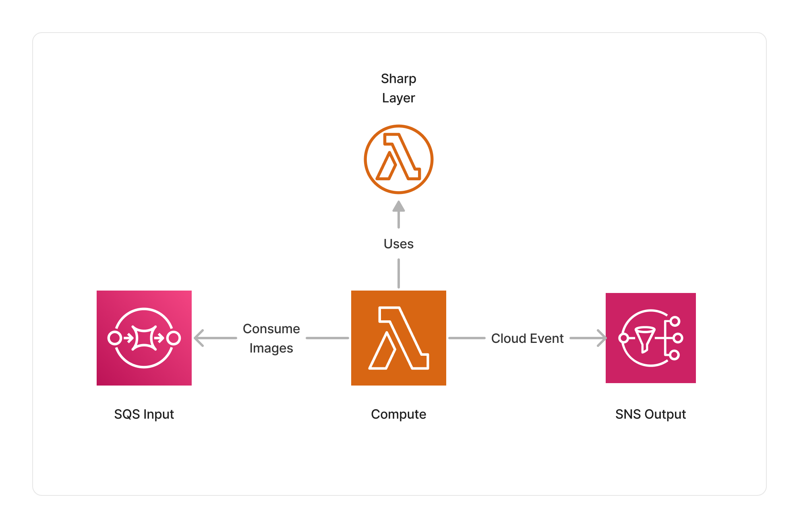

<span title="Label: Pro" data-view-component="true" class="Label Label--api text-uppercase">
  Unstable API
</span>
<span title="Label: Pro" data-view-component="true" class="Label Label--version text-uppercase">
  0.1.4
</span>
<span title="Label: Pro" data-view-component="true" class="Label Label--package">
  @project-lakechain/sharp-image-transform
</span>
<br>

---

The Sharp middleware can be used to apply transformations to images at scale, such as resizing, cropping, rotating, and applying filters on images. It is based on the [`Sharp`](https://sharp.pixelplumbing.com/) library which provides a very efficient way to apply transformations to images using [`libvips`](https://www.libvips.org/).

<br>


<br>

### 🖼️ Transforming Images

To use this middleware, you import it in your CDK stack and declare the transforms you want to apply on images. Developers can use the same API as the native [Sharp API](https://sharp.pixelplumbing.com/) to declare the transforms to apply on images.

> ℹ️ The below example showcases how to resize input images to 200x200 pixels.

```typescript
import { SharpImageTransform, sharp } from '@project-lakechain/sharp-image-transform';
import { CacheStorage } from '@project-lakechain/core';

class Stack extends cdk.Stack {
  constructor(scope: cdk.Construct, id: string) {
    const cache = new CacheStorage(this, 'Cache');
    
    // Create the Sharp image transform.
    const transform = new SharpImageTransform.Builder()
      .withScope(this)
      .withIdentifier('Transform')
      .withCacheStorage(cache)
      .withSource(source) // 👈 Specify a data source
      .withSharpTransforms(
        sharp()
          .resize(200, 200)
      )
      .build();
  }
}
```

<br>

---

#### Chaining Transforms

The Sharp API transform actions can be chained to apply multiple transforms to an image.

> ℹ️ The below example resizes input images to a width of 500px, applies a grayscale filter, flips the image, and converts it to PNG if it's not already.

```typescript
const transform = new SharpImageTransform.Builder()
  .withScope(this)
  .withIdentifier('Transform')
  .withCacheStorage(cache)
  .withSource(source)
  .withSharpTransforms(
    sharp()
      .resize(500)
      .grayscale()
      .flip()
      .png()
  )
  .build();
```

<br>

---

### 🔗 External References

Some of the Sharp APIs, such as the [`composite`](https://sharp.pixelplumbing.com/api-composite) API, can combine other images with the currently processed image. You can use a `reference`, part of the Lakechain DSL language, to pass an external image to these APIs.

> ℹ️ The below example applies an external image on S3 as a watermark to the currently processed image.

```typescript
import { SharpImageTransform, sharp } from '@project-lakechain/sharp-image-transform';
import * as r from '@project-lakechain/core/dsl/vocabulary/reference';

// Sample bucket.
const bucket = new s3.Bucket(this, 'Bucket', {});

// Create the Sharp image transform.
const transform = new SharpImageTransform.Builder()
  .withScope(this)
  .withIdentifier('Transform')
  .withCacheStorage(cache)
  .withSource(source)
  .withSharpTransforms(
    sharp()
      .composite([{
        input: r.reference(
          r.url(`s3://${bucket.bucketName}/watermark/watermark.png`)
        )
      }])
      .png()
  )
  .build();

// Grant the middleware access to the watermark image.
bucket.grantRead(transform);
```

<br>

---

### 🏗️ Architecture

The Sharp transform middleware runs within a Lambda compute leveraging a Lambda Layer containing the Sharp library for ARM64.



<br>

---

### 🏷️ Properties

<br>

##### Supported Inputs

|  Mime Type  | Description |
| ----------- | ----------- |
| `image/jpeg` | JPEG images. |
| `image/png` | PNG images. |
| `image/tiff` | TIFF images. |
| `image/webp` | WebP images. |
| `image/avif` | AVIF images. |
| `image/gif` | GIF images. |
| `image/heic` | HEIC images. |
| `image/heif` | HEIF images. |

##### Supported Outputs

*This middleware supports as outputs the same types as the supported inputs.*

##### Supported Compute Types

| Type  | Description |
| ----- | ----------- |
| `CPU` | This middleware only supports CPU compute. |

<br>

---

### 📖 Examples

- [Image Transforms Pipeline](https://github.com/awslabs/project-lakechain/tree/main/examples/simple-pipelines/image-transforms-pipeline) - A pipeline showcasing how to transform images.
- [Image Watermarking Pipeline](https://github.com/awslabs/project-lakechain/tree/main/examples/simple-pipelines/image-watermarking-pipeline) - A pipeline showcasing how to watermark images.
