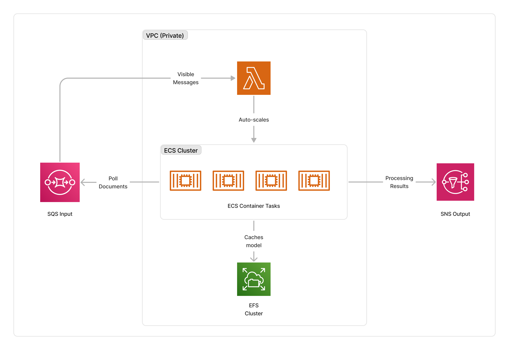
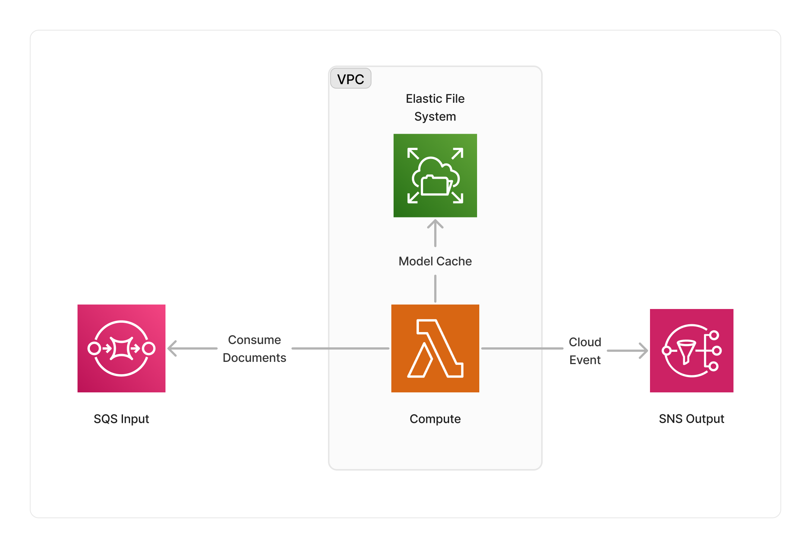

<span title="Label: Pro" data-view-component="true" class="Label Label--api text-uppercase">
  Unstable API
</span>
<span title="Label: Pro" data-view-component="true" class="Label Label--version text-uppercase">
  0.3.4
</span>
<span title="Label: Pro" data-view-component="true" class="Label Label--package">
  @project-lakechain/bert-extractive-summarizer
</span>
<br>

---

The BERT extractive summarizer is a middleware allowing to summarize text documents using the [BERT Extractive Summarizer](https://pypi.org/project/bert-extractive-summarizer/) and the HuggingFace Pytorch transformers libraries. It makes it possible to run extractive summarization on text documents within a document processing pipeline.

---

### 📝 Summarizing Text

To use this middleware, you import it in your CDK stack and connect it to a data source that provides text documents, such as the [S3 Trigger](/project-lakechain/triggers/s3-event-trigger) if your text documents are stored in S3.

> ℹ️ The below example shows how to create a pipeline that summarizes text documents uploaded to an S3 bucket.

```typescript
import { S3EventTrigger } from '@project-lakechain/s3-event-trigger';
import { BertExtractiveSummarizer } from '@project-lakechain/bert-extractive-summarizer';
import { CacheStorage } from '@project-lakechain/core';

class Stack extends cdk.Stack {
  constructor(scope: cdk.Construct, id: string) {
    // Sample VPC.
    const vpc = new ec2.Vpc(this, 'VPC', {});

    // The cache storage.
    const cache = new CacheStorage(this, 'Cache');

    // Create the S3 event trigger.
    const trigger = new S3EventTrigger.Builder()
      .withScope(this)
      .withIdentifier('Trigger')
      .withCacheStorage(cache)
      .withBucket(bucket)
      .build();

    // Summarize uploaded text documents.
    trigger.pipe(new BertExtractiveSummarizer.Builder()
      .withScope(this)
      .withIdentifier('BertSummarizer')
      .withCacheStorage(cache)
      .withSource(trigger)
      .withVpc(vpc)
      .build());
  }
}
```

<br>

---

#### Summarization Ratio

You can specify a ratio indicating how much of the original text you want to keep in the summary.

> 💁 The default value is `0.2` (20% of the original text), and you can opt for a value between `0.1` and `1.0`.

```typescript
const summarizer = new BertExtractiveSummarizer.Builder()
  .withScope(this)
  .withIdentifier('BertSummarizer')
  .withCacheStorage(cache)
  .withSource(source)
  .withVpc(vpc)
  .withRatio(0.3)
  .build();
```

<br>

---

#### Auto-Scaling

The cluster of containers deployed by this middleware will auto-scale based on the number of text documents that need to be processed. The cluster scales up to a maximum of 5 instances by default, and scales down to zero when there are no documents to process.

> ℹ️ You can configure the maximum amount of instances that the cluster can auto-scale to by using the `withMaxInstances` method. Note that this is only valid when using this middleware using a GPU compute type.

```typescript
const summarizer = new BertExtractiveSummarizer.Builder()
  .withScope(this)
  .withIdentifier('BertSummarizer')
  .withCacheStorage(cache)
  .withSource(source)
  .withVpc(vpc)
  .withMaxInstances(10)
  .build();
```

<br>

---

### 🏗️ Architecture

This middleware supports both `CPU` and `GPU` compute types. We implemented 2 different architectures, one that's GPU based and using ECS, the other which is CPU based and serverless, based on AWS Lambda. You can use the [`.withComputeType`](/project-lakechain/guides/api#compute-types) API to select the compute type you want to use.

> 💁 By default, this implementation will run on the `CPU` compute type.

#### GPU Architecture

The GPU architecture leverages AWS ECS to run the summarization process on [`g4dn.xlarge`](https://aws.amazon.com/ec2/instance-types/g4/) instances. The GPU instance is part of a ECS cluster, and the cluster is part of a VPC, running within its private subnets.



#### CPU Architecture

The CPU architecture leverages AWS Lambda to run the summarization process on serverless compute. The Lambda function runs as part of a VPC and is integrated with AWS EFS to cache the BERT model(s).



<br>

---

### 🏷️ Properties

<br>

##### Supported Inputs

|  Mime Type  | Description |
| ----------- | ----------- |
| `text/plain` | UTF-8 text documents. |

##### Supported Outputs

|  Mime Type  | Description |
| ----------- | ----------- |
| `text/plain` | UTF-8 text documents. |

##### Supported Compute Types

| Type  | Description |
| ----- | ----------- |
| `CPU` | This middleware supports CPU compute. |
| `GPU` | This middleware supports GPU compute. |

<br>

---

### 📖 Examples

- [Extractive Summarization Pipeline](https://github.com/awslabs/project-lakechain/tree/main/examples/simple-pipelines/summarization-pipelines/extractive-summarization-pipeline/) - Builds a pipeline for text summarization using BERT extractive summarizer.
