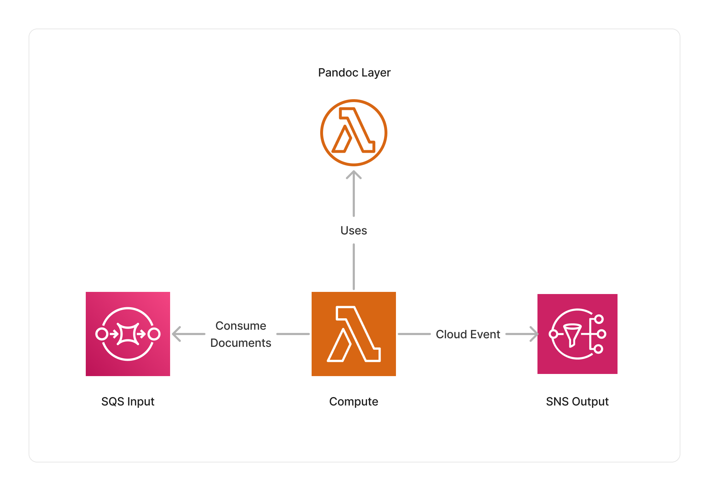

<span title="Label: Pro" data-view-component="true" class="Label Label--api text-uppercase">
  Unstable API
</span>
<span title="Label: Pro" data-view-component="true" class="Label Label--version text-uppercase">
  0.3.4
</span>
<span title="Label: Pro" data-view-component="true" class="Label Label--package">
  @project-lakechain/pandoc-text-converter
</span>
<br>

---

The Pandoc middleware converts at scale documents from a matrix of multiple formats using the [Pandoc](https://pandoc.org/) project. You can for example convert HTML, Docx, or Markdown documents into plain text to be able to run NLP analysis, or convert Markdown documents into PDF documents for creating nice-looking reports.

---

### 🔁 Converting Documents

To use this middleware, you import it in your CDK stack and instantiate it as part of a pipeline.

> 💁 The below example takes supported input document types uploaded into a source S3 bucket, and converts them to plain text.

```typescript
import { S3EventTrigger } from '@project-lakechain/s3-event-trigger';
import { PandocTextConverter } from '@project-lakechain/pandoc-text-converter';
import { CacheStorage } from '@project-lakechain/core';

class Stack extends cdk.Stack {
  constructor(scope: cdk.Construct, id: string) {
    // The cache storage.
    const cache = new CacheStorage(this, 'Cache');
    
    // Create the S3 event trigger.
    const trigger = new S3EventTrigger.Builder()
      .withScope(this)
      .withIdentifier('Trigger')
      .withCacheStorage(cache)
      .withBucket(bucket)
      .build();
    
    // Convert uploaded documents to plain text.
    trigger.pipe(new PandocTextConverter.Builder()
      .withScope(this)
      .withIdentifier('PandocTextConverter')
      .withCacheStorage(cache)
      .withSource(trigger)
      .build());
  }
}
```

<br>

---

#### Conversion Matrix

By default, the Pandoc text converter will convert supported input documents to plain text. You can however explicitly specify a conversion matrix describing which inputs to converts into which outputs.

> 💁 The below example demonstrates how to convert Docx documents to both plain text and PDF, and Markdown documents to HTML.

```typescript
import { PandocTextConverter, from } from '@project-lakechain/pandoc-text-converter';

const pandoc = new PandocTextConverter.Builder()
  .withScope(this)
  .withIdentifier('PandocTextConverter')
  .withCacheStorage(cache)
  .withSource(trigger)
  .withConversions(
    from('docx').to('plain', 'pdf'),
    from('md').to('html')
  )
  .build();
```

<br>

---

### 🏗️ Architecture

This middleware is based on a Python Lambda compute running the Pandoc project using the [`pypandoc`](https://pypi.org/project/pypandoc/) library packaged as a Lambda layer.



<br>

---

### 🏷️ Properties

<br>

##### Supported Inputs

|  Mime Type  | Description |
| ----------- | ----------- |
| `application/epub+zip` | EPUB documents. |
| `text/csv` | CSV documents. |
| `text/tab-separated-values` | TSV documents. |
| `application/vnd.openxmlformats-officedocument.wordprocessingml.document` | Word documents. |
| `text/markdown` | Markdown documents. |
| `text/html` | HTML documents. |
| `application/vnd.oasis.opendocument.text` | OpenOffice documents. |
| `application/rtf` | RTF documents. |
| `application/x-tex` | LaTeX documents. |
| `text/x-rst` | RST documents. |
| `text/x-textile` | Textile documents. |
| `application/x-ipynb+json` | Jupyter Notebook documents. |
| `text/troff` | Manual documents. |
| `application/x-bibtex` | BibTex documents. |
| `application/docbook+xml` | Docbook documents. |
| `application/x-fictionbook+xml` | FictionBook documents. |
| `text/x-opml` | OPML documents. |
| `application/x-texinfo` | Texinfo documents. |

##### Supported Outputs

|  Mime Type  | Description |
| ----------- | ----------- |
| `text/x-asciidoc` | Asciidoc documents. |
| `application/x-bibtex` | BibTex documents. |
| `application/docbook+xml` | Docbook documents. |
| `application/vnd.openxmlformats-officedocument.wordprocessingml.document` | Word documents. |
| `application/epub+zip` | EPUB documents. |
| `application/x-fictionbook+xml` | FictionBook documents. |
| `text/x-haskell` | Haskell documents. |
| `text/html` | HTML documents. |
| `application/xml` | XML documents. |
| `application/x-ipynb+json` | Jupyter Notebook documents. |
| `application/json` | JSON documents. |
| `application/x-tex` | LaTeX documents. |
| `text/troff` | Manual documents. |
| `text/markdown` | Markdown documents. |
| `text/plain` | Plain text documents. |
| `application/vnd.oasis.opendocument.text` | OpenOffice documents. |
| `text/x-opml` | OPML documents. |
| `application/pdf` | PDF documents. |
| `application/vnd.openxmlformats-officedocument.presentationml.presentation` | PowerPoint documents. |
| `text/x-rst` | RST documents. |
| `application/rtf` | RTF documents. |
| `application/x-texinfo` | Texinfo documents. |
| `text/x-textile` | Textile documents. |

##### Supported Compute Types

| Type  | Description |
| ----- | ----------- |
| `CPU` | This middleware only supports CPU compute. |

<br>

---

### 📖 Examples

- [Building a RAG Pipeline](https://github.com/awslabs/project-lakechain/tree/main/examples/end-to-end-use-cases/building-a-rag-pipeline/) - End-to-end RAG pipeline using Amazon Bedrock and Amazon OpenSearch.
- [Pipeline Encryption](https://github.com/awslabs/project-lakechain/tree/main/examples/simple-pipelines/pipeline-encryption/) - An example showcasing how to encrypt end-to-end a pipeline using a CMK.
