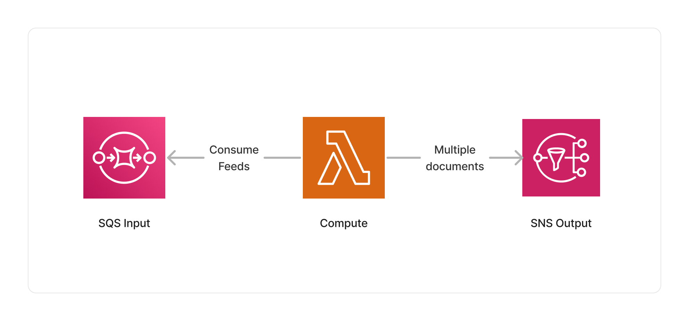

<span title="Label: Pro" data-view-component="true" class="Label Label--api text-uppercase">
  Unstable API
</span>
<span title="Label: Pro" data-view-component="true" class="Label Label--version text-uppercase">
  0.7.0
</span>
<span title="Label: Pro" data-view-component="true" class="Label Label--package">
  <a target="_blank" href="https://www.npmjs.com/package/@project-lakechain/syndication-feed-processor">
    @project-lakechain/syndication-feed-processor
  </a>
</span>
<span class="language-icon">
  <svg role="img" viewBox="0 0 24 24" width="30" xmlns="http://www.w3.org/2000/svg" style="fill: #3178C6;"><title>TypeScript</title><path d="M1.125 0C.502 0 0 .502 0 1.125v21.75C0 23.498.502 24 1.125 24h21.75c.623 0 1.125-.502 1.125-1.125V1.125C24 .502 23.498 0 22.875 0zm17.363 9.75c.612 0 1.154.037 1.627.111a6.38 6.38 0 0 1 1.306.34v2.458a3.95 3.95 0 0 0-.643-.361 5.093 5.093 0 0 0-.717-.26 5.453 5.453 0 0 0-1.426-.2c-.3 0-.573.028-.819.086a2.1 2.1 0 0 0-.623.242c-.17.104-.3.229-.393.374a.888.888 0 0 0-.14.49c0 .196.053.373.156.529.104.156.252.304.443.444s.423.276.696.41c.273.135.582.274.926.416.47.197.892.407 1.266.628.374.222.695.473.963.753.268.279.472.598.614.957.142.359.214.776.214 1.253 0 .657-.125 1.21-.373 1.656a3.033 3.033 0 0 1-1.012 1.085 4.38 4.38 0 0 1-1.487.596c-.566.12-1.163.18-1.79.18a9.916 9.916 0 0 1-1.84-.164 5.544 5.544 0 0 1-1.512-.493v-2.63a5.033 5.033 0 0 0 3.237 1.2c.333 0 .624-.03.872-.09.249-.06.456-.144.623-.25.166-.108.29-.234.373-.38a1.023 1.023 0 0 0-.074-1.089 2.12 2.12 0 0 0-.537-.5 5.597 5.597 0 0 0-.807-.444 27.72 27.72 0 0 0-1.007-.436c-.918-.383-1.602-.852-2.053-1.405-.45-.553-.676-1.222-.676-2.005 0-.614.123-1.141.369-1.582.246-.441.58-.804 1.004-1.089a4.494 4.494 0 0 1 1.47-.629 7.536 7.536 0 0 1 1.77-.201zm-15.113.188h9.563v2.166H9.506v9.646H6.789v-9.646H3.375z"/></svg>
</span>
<div style="margin-top: 26px"></div>

---

The Syndication feed parser makes it possible to parse [RSS](https://en.wikipedia.org/wiki/RSS) and [Atom](https://en.wikipedia.org/wiki/Atom_(web_standard)) feeds from upstream documents, extract each feed item from the feeds, and forward them, along with their metadata to other middlewares in the pipeline.

---

### 📰 Parsing Feeds

To use this middleware, you import it in your CDK stack and instantiate it as part of a pipeline.

```typescript
import { SyndicationFeedProcessor } from '@project-lakechain/syndication-feed-processor';
import { CacheStorage } from '@project-lakechain/core';

class Stack extends cdk.Stack {
  constructor(scope: cdk.Construct, id: string) {
    const cache = new CacheStorage(this, 'Cache');
    
    // Create the syndication feed processor.
    const syndicationProcessor = new SyndicationFeedProcessor.Builder()
      .withScope(this)
      .withIdentifier('SyndicationProcessor')
      .withCacheStorage(cache)
      .withSource(source) // 👈 Specify a data source
      .build();
  }
}
```

<br>

---

### 📝 Metadata

This middleware will automatically extract feed item metadata and make them available as part of the output [CloudEvents](/project-lakechain/general/events). The following metadata are extracted, when available, from feed items.

| Metadata      | Description |
|---------------|-------------|
| `title`       | The title of the feed item. |
| `description` | The description of the feed item. |
| `createdAt`   | The creation date of the feed item. |
| `updatedAt`   | The last update date of the feed item. |
| `authors`      | The authors associated with the feed item. |
| `keywords`    | The keywords associated with the feed item. |
| `language`    | The language of the feed item. |

<br>

---

### 📄 Output

This middleware takes as an input RSS or Atom syndication feeds, and outputs *multiple* HTML documents that are associated with each extracted feeds. This makes it possible for downstream middlewares to process each HTML document that is part of the original feed in parallel.

Below is an example of an output HTML document extracted from a feed item by the syndication feed processor.

<details>
  <summary>💁 Click to expand example</summary>

  ```json
  {
    "specversion": "1.0",
    "id": "1780d5de-fd6f-4530-98d7-82ebee85ea39",
    "type": "document-created",
    "time": "2023-10-22T13:19:10.657Z",
    "data": {
      "chainId": "6ebf76e4-f70c-440c-98f9-3e3e7eb34c79",
      "source": {
        "url": "https://aws.amazon.com/blogs/aws/feed/",
        "type": "application/rss+xml",
        "size": 24536,
        "etag": "1243cbd6cf145453c8b5519a2ada4779"
      },
      "document": {
        "url": "https://aws.amazon.com/blogs/aws/aws-weekly-roundup-amazon-ecs-rds-for-mysql-emr-studio-aws-community-and-more-january-22-2024/",
        "type": "text/html",
        "size": 19526,
        "etag": "2a3b4c5d6e7f8d9e0a1b2c3d4e5f6a7b"
      },
      "metadata": {
        "title": "AWS Weekly Roundup: Amazon ECS, RDS for MySQL, and More – January 22, 2024",
        "description": "Check out the latest announcements from AWS in the AWS Weekly Roundup.",
        "createdAt": "2024-01-22T00:00:00.000Z",
        "updatedAt": "2024-01-22T00:00:00.000Z",
        "authors": ["Jeff Barr"],
        "keywords": ["Amazon ECS", "RDS for MySQL", "EMR Studio", "AWS Community"],
        "properties": {
          "kind": "text",
          "attrs": {
            "language": "en"
          }
        }
      },
      "callStack": []
    }
  }
  ```

</details>

<br>

---

### ℹ️ Limits

This middleware will not attempt to request via HTTP the feed items to compute their size. Therefore, the `size` property on the document event for feed items is not specified on output events.

Another limitation lies in that this middleware only outputs HTML documents, and does not currently forward [RSS Enclosures](https://en.wikipedia.org/wiki/RSS_enclosure) to downstream middlewares (e.g associated images or video documents).

<br>

---

### 🏗️ Architecture

This middleware is based on a Lambda compute using the [`feedparser`](https://pypi.org/project/feedparser/) Python library to parse the feeds and extract the feed items.



<br>

---

### 🏷️ Properties

<br>

##### Supported Inputs

|  Mime Type  | Description |
| ----------- | ----------- |
| `application/rss+xml` | RSS feeds. |
| `application/atom+xml` | Atom feeds. |

##### Supported Outputs

|  Mime Type  | Description |
| ----------- | ----------- |
| `text/html` | HTML documents. |

##### Supported Compute Types

| Type  | Description |
| ----- | ----------- |
| `CPU` | This middleware only supports CPU compute. |

<br>

---

### 📖 Examples

- [Article Curation Pipeline](https://github.com/awslabs/project-lakechain/tree/main/examples/simple-pipelines/article-curation-pipeline/) - Builds a pipeline converting HTML articles into plain text.
