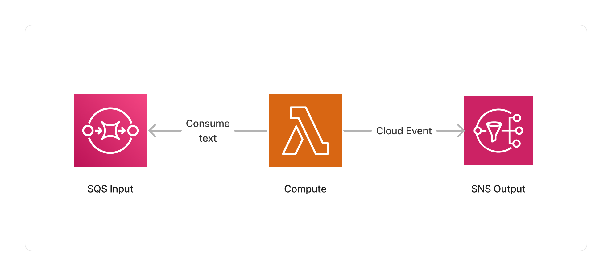

<span title="Label: Pro" data-view-component="true" class="Label Label--api text-uppercase">
  Unstable API
</span>
<span title="Label: Pro" data-view-component="true" class="Label Label--version text-uppercase">
  0.1.4
</span>
<span title="Label: Pro" data-view-component="true" class="Label Label--package">
  @project-lakechain/character-text-splitter
</span>
<br>

---

The character text splitter can be used to split text documents at scale based on a string delimiter, a maximum chunk size, and a given chunk overlap. This implementation is based on Langchain's [`CharacterTextSplitter`](https://js.langchain.com/docs/modules/data_connection/document_transformers/character_text_splitter).

---

### 📝 Splitting Text

To use this middleware, you import it in your CDK stack, and connect it to a data source providing text documents, such as the [S3 Trigger](/project-lakechain/triggers/s3-event-trigger).

```typescript
import { CharacterTextSplitter } from '@project-lakechain/character-text-splitter';
import { CacheStorage } from '@project-lakechain/core';

class Stack extends cdk.Stack {
  constructor(scope: cdk.Construct, id: string) {
    // The cache storage.
    const cache = new CacheStorage(this, 'Cache');

    // Create the character text splitter.
    const splitter = new CharacterTextSplitter.Builder()
      .withScope(this)
      .withIdentifier('Splitter')
      .withCacheStorage(cache)
      .withSource(source) // 👈 Specify a data source
      .build();
  }
}
```

<br>

---

#### Options

You can customize the way that the text splitter will split text documents by specifying a custom delimiter string, a maximum chunk size, and a chunk overlap.

> ℹ️ The below example splits text documents based on the `\r\n` delimiter, with a maximum chunk size of `4096` characters, and a chunk overlap of `200`.

```typescript
const splitter = new CharacterTextSplitter.Builder()
  .withScope(this)
  .withIdentifier('Splitter')
  .withCacheStorage(cache)
  .withSource(source)
  .withSeparator('\r\n')
  .withChunkSize(4096)
  .withChunkOverlap(200)
  .build();
```

The default values for this middleware options are documented below.

| Option | Default | Description |
| ------ | ------- | --- |
| `separator` | `\n\n` | The delimiter to use to split text documents. |
| `chunkSize` | `4000` | The maximum size of each text chunk. |
| `chunkOverlap` | `200` | The characters to overlap between chunks. |

<br>

---

### 📄 Output

This middleware takes as an input text documents of a given size, and outputs *multiple* text documents that are the result of the text splitting process. This allows to process each chunk of text in parallel in downstream middlewares.

In addition to producing new text documents, this middleware also associates metadata with each chunk, such as the chunk identifier and order relative to the original document. Below is an example of `CloudEvent` produced by this middleware.

<details>
  <summary>💁 Click to expand example</summary>

  ```json
  {
    "specversion": "1.0",
    "id": "1780d5de-fd6f-4530-98d7-82ebee85ea39",
    "type": "document-created",
    "time": "2023-10-22T13:19:10.657Z",
    "data": {
        "chainId": "6ebf76e4-f70c-440c-98f9-3e3e7eb34c79",
        "source": {
            "url": "s3://bucket/text.txt",
            "type": "text/plain",
            "size": 24536,
            "etag": "1243cbd6cf145453c8b5519a2ada4779"
        },
        "document": {
            "url": "s3://bucket/text.txt",
            "type": "text/plain",
            "size": 24536,
            "etag": "1243cbd6cf145453c8b5519a2ada4779"
        },
        "metadata": {
          "properties": {
            "kind": "text",
            "attrs": {
              "chunk": {
                "id": "4a5b6c7d8e9fd21dacb",
                "order": 0
              }
            }
          }
        },
        "callStack": []
    }
  }
  ```

</details>

<br>

---

### 🏗️ Architecture

This middleware runs within a Lambda compute based on the ARM64 architecture, and packages the [Langchain library](https://js.langchain.com/docs/get_started/introduction) to run the text splitting process.



<br>

---

### 🏷️ Properties

<br>

##### Supported Inputs

|  Mime Type  | Description |
| ----------- | ----------- |
| `text/plain` | UTF-8 text documents. |

##### Supported Outputs

|  Mime Type  | Description |
| ----------- | ----------- |
| `text/plain` | UTF-8 text documents. |

##### Supported Compute Types

| Type  | Description |
| ----- | ----------- |
| `CPU` | This middleware only supports CPU compute. |

<br>

---

### 📖 Examples

- [Text Splitting Pipeline](https://github.com/awslabs/project-lakechain/tree/main/examples/simple-pipelines/text-splitting-pipeline) - Builds a pipeline for splitting text documents using different text splitting algorithms.
